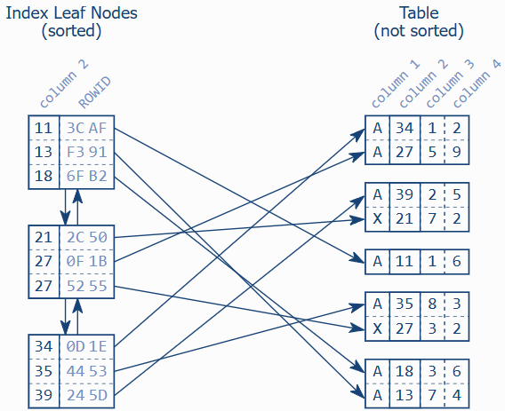
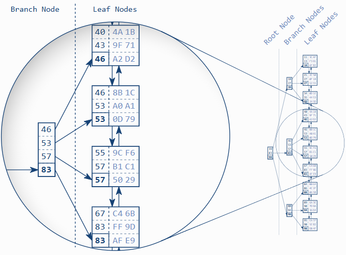
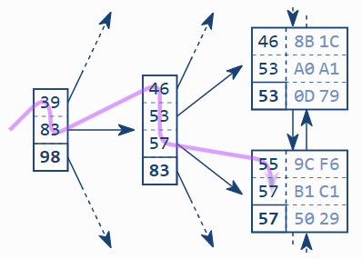

# Anatomy of an SQL Index

“An index makes the query fast” is the most basic explanation of an index I have ever seen. Although it describes the most important aspect of an index very well, it is—unfortunately—not sufficient for this book. This chapter describes the index structure in a less superficial way but doesn’t dive too deeply into details. It provides just enough insight for one to understand the SQL performance aspects discussed throughout the book.

An index is a distinct structure in the database that is built using the create index statement. It requires its own disk space and holds a copy of the indexed table data. That means that an index is pure redundancy. Creating an index does not change the table data; it just creates a new data structure that refers to the table. A database index is, after all, very much like the index at the end of a book: it occupies its own space, it is highly redundant, and it refers to the actual information stored in a different place.

---
**Clustered Indexes (SQL Server, MySQL/InnoDB)**
SQL Server and MySQL (using InnoDB) take a broader view of what “index” means. They refer to tables that consist of the index structure only as clustered indexes. These tables are called Index-Organized Tables (IOT) in the Oracle database.

Chapter 5, “Clustering Data: The Second Power of Indexing”, describes them in more detail and explains their advantages and disadvantages.
---

Searching in a database index is like searching in a printed telephone directory. The key concept is that all entries are arranged in a well-defined order. Finding data in an ordered data set is fast and easy because the sort order determines each entry’s position.

If you like this page, you might also like …
… to subscribe my mailing lists, get free stickers, buy my book or join a training.

A database index is, however, more complex than a printed directory because it undergoes constant change. Updating a printed directory for every change is impossible for the simple reason that there is no space between existing entries to add new ones. A printed directory bypasses this problem by only handling the accumulated updates with the next printing. An SQL database cannot wait that long. It must process insert, delete and update statements immediately, keeping the index order without moving large amounts of data.

The database combines two data structures to meet the challenge: a doubly linked list and a search tree. These two structures explain most of the database’s performance characteristics.

**Contents**
---
1. The Leaf Nodes — A doubly linked list
2. The B-Tree — It’s a balanced tree
3. Slow Indexes, Part I — Two ingredients make the index slow

## The Index Leaf Nodes

The primary purpose of an index is to provide an ordered representation of the indexed data. It is, however, not possible to store the data sequentially because an insert statement would need to move the following entries to make room for the new one. Moving large amounts of data is very time-consuming so the insert statement would be very slow. The solution to the problem is to establish a logical order that is independent of physical order in memory.

If you like this page, you might also like …
… to subscribe my mailing lists, get free stickers, buy my book or join a training.

The logical order is established via a doubly linked list. Every node has links to two neighboring entries, very much like a chain. New nodes are inserted between two existing nodes by updating their links to refer to the new node. The physical location of the new node doesn’t matter because the doubly linked list maintains the logical order.

The data structure is called a doubly linked list because each node refers to the preceding and the following node. It enables the database to read the index forwards or backwards as needed. It is thus possible to insert new entries without moving large amounts of data—it just needs to change some pointers.

Doubly linked lists are also used for collections (containers) in many programming languages.

| Programming Language | Name                                      |
|----------------------|-------------------------------------------|
| Java                 | `java.util.LinkedList`                    |
| .NET Framework       | `System.Collections.Generic.LinkedList`  |
| C++                  | `std::list`                               |

Databases use doubly linked lists to connect the so-called index leaf nodes. Each leaf node is stored in a database block or page; that is, the database’s smallest storage unit. All index blocks are of the same size—typically a few kilobytes. The database uses the space in each block to the extent possible and stores as many index entries as possible in each block. That means that the index order is maintained on two different levels: the index entries within each leaf node, and the leaf nodes among each other using a doubly linked list.

Figure 1.1 Index Leaf Nodes and Corresponding 

Figure 1.1 illustrates the index leaf nodes and their connection to the table data. Each index entry consists of the indexed columns (the key, column 2) and refers to the corresponding table row (via ROWID or RID). Unlike the index, the table data is stored in a heap structure and is not sorted at all. There is neither a relationship between the rows stored in the same table block nor is there any connection between the blocks.

## The Search Tree (B-Tree) Makes the Index Fast
The index leaf nodes are stored in an arbitrary order—the position on the disk does not correspond to the logical position according to the index order. It is like a telephone directory with shuffled pages. If you search for “Smith” but first open the directory at “Robinson”, it is by no means granted that Smith follows Robinson. A database needs a second structure to find the entry among the shuffled pages quickly: a balanced search tree—in short: the B-tree.

**Figure 1.2 B-tree Structure**

Figure 1.2 shows an example index with 30 entries. The doubly linked list establishes the logical order between the leaf nodes. The root and branch nodes support quick searching among the leaf nodes.

The figure highlights a branch node and the leaf nodes it refers to. Each branch node entry corresponds to the biggest value in the respective leaf node. Take the first leaf node as an example: the biggest value in this node is 46, which is thus stored in the corresponding branch node entry. The same is true for the other leaf nodes so that in the end the branch node has the values 46, 53, 57 and 83. According to this scheme, a branch layer is built up until all the leaf nodes are covered by a branch node.

If you like this page, you might also like …
… to subscribe my mailing lists, get free stickers, buy my book or join a training.

The next layer is built similarly, but on top of the first branch node level. The procedure repeats until all keys fit into a single node, the root node. The structure is a balanced search tree because the tree depth is equal at every position; the distance between root node and leaf nodes is the same everywhere.

Note
A B-tree is a balanced tree—not a binary tree.

Once created, the database maintains the index automatically. It applies every insert, delete and update to the index and keeps the tree in balance, thus causing maintenance overhead for write operations. [Chapter 8, “Modifying Data”](TODO), explains this in more detail.

Figure 1.3 B-Tree Traversal

Figure 1.3 shows an index fragment to illustrate a search for the key “57”. The tree traversal starts at the root node on the left-hand side. Each entry is processed in ascending order until a value is greater than or equal to (>=) the search term (57). In the figure it is the entry 83. The database follows the reference to the corresponding branch node and repeats the procedure until the tree traversal reaches a leaf node.

Important
The B-tree enables the database to find a leaf node quickly.

The tree traversal is a very efficient operation—so efficient that I refer to it as the first power of indexing. It works almost instantly—even on a huge data set. That is primarily because of the tree balance, which allows accessing all elements with the same number of steps, and secondly because of the logarithmic growth of the tree depth. That means that the tree depth grows very slowly compared to the number of leaf nodes. Real world indexes with millions of records have a tree depth of four or five. A tree depth of six is hardly ever seen. The box “Logarithmic Scalability” describes this in more detail.

Logarithmic Scalability
In mathematics, the logarithm of a number to a given base is the power or exponent to which the base must be raised in order to produce the number [Wikipedia](https://en.wikipedia.org/wiki/Logarithm).

In a search tree the base corresponds to the number of entries per branch node and the exponent to the tree depth. The example index in Figure 1.2 holds up to four entries per node and has a tree depth of three. That means that the index can hold up to 64 (43) entries. If it grows by one level, it can already hold 256 entries (44). Each time a level is added, the maximum number of index entries quadruples. The logarithm reverses this function. The tree depth is therefore log4(number-of-index-entries).

| Tree Depth | Index Entries |
|------------|---------------|
| 3          | 64            |
| 4          | 256           |
| 5          | 1,024         |
| 6          | 4,096         |
| 7          | 16,384        |
| 8          | 65,536        |
| 9          | 262,144       |
| 10         | 1,048,576     |

The logarithmic growth enables the example index to search a million records with ten tree levels, but a real world index is even more efficient. The main factor that affects the tree depth, and therefore the lookup perfor­mance, is the number of entries in each tree node. This number corresponds to—mathematically speaking—the basis of the loga­rithm. The higher the basis, the shallower the tree, the faster the traversal.

Databases exploit this concept to a maximum extent and put as many entries as possible into each node—often hundreds. That means that every new index level supports a hundred times more entries.

Links
[B+tree simulator](TODO)

## Slow Indexes, Part I
Despite the efficiency of the tree traversal, there are still cases where an index lookup doesn’t work as fast as expected. This contradiction has fueled the myth of the “degenerated index” for a long time. The myth proclaims an index rebuild as the miracle solution. Appendix B, “Myth Directory” covers this and other myths in detail. For now, you can take it for granted that rebuilding an index does not improve performance on the long run. The real reason trivial statements can be slow—even when using an index—can be explained on the basis of the previous sections.

The first ingredient for a slow index lookup is the leaf node chain. Consider the search for “57” in Figure 1.3 again. There are obviously two matching entries in the index. At least two entries are the same, to be more precise: the next leaf node could have further entries for “57”. The database must read the next leaf node to see if there are any more matching entries. That means that an index lookup not only needs to perform the tree traversal, it also needs to follow the leaf node chain.

If you like this page, you might also like …
… to subscribe my mailing lists, get free stickers, buy my book or join a training.

The second ingredient for a slow index lookup is accessing the table. Even a single leaf node might contain many hits—often hundreds. The corresponding table data is usually scattered across many table blocks (see [Figure 1.1, “Index Leaf Nodes and Corresponding Table Data”](TODO)). That means that there is an additional table access for each hit.

An index lookup requires three steps: (1) the tree traversal; (2) following the leaf node chain; (3) fetching the table data. The tree traversal is the only step that has an upper bound for the number of accessed blocks—the index depth. The other two steps might need to access many blocks—they cause a slow index lookup.

The origin of the “slow indexes” myth is the misbelief that an index lookup just traverses the tree, hence the idea that a slow index must be caused by a “broken” or “unbalanced” tree. The truth is that you can actually ask most databases how they use an index. The Oracle database is rather verbose in this respect and has three distinct operations that describe a basic index lookup:

INDEX UNIQUE SCAN
The INDEX UNIQUE SCAN performs the tree traversal only. The Oracle database uses this operation if a unique constraint ensures that the search criteria will match no more than one entry.

INDEX RANGE SCAN
The INDEX RANGE SCAN performs the tree traversal and follows the leaf node chain to find all matching entries. This is the fall­back operation if multiple entries could possibly match the search criteria.

TABLE ACCESS BY INDEX ROWID
The TABLE ACCESS BY INDEX ROWID operation retrieves the row from the table. This operation is (often) performed for every matched record from a preceding index scan operation.

The important point is that an INDEX RANGE SCAN can potentially read a large part of an index. If there is one more table access for each row, the query can become slow even when using an index.