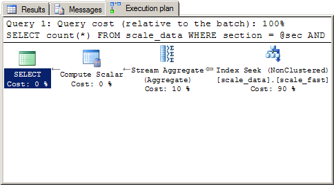
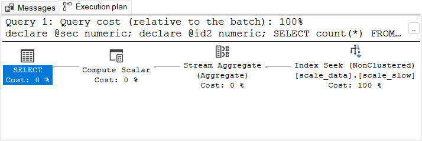

# Testing and Scalability

## Testing and Scalability

> Source: https://use-the-index-luke.com/sql/testing-scalability

This chapter is about performance and scalability of databases.

In this context, I am using the following definition for scalability:

> ```
> Scalability is the ability of a system, network, or process,
> to handle a growing amount of work in a capable manner
> or
> its ability to be enlarged to accommodate that growth.
> ```
>
> — [Wikipedia](https://en.wikipedia.org/wiki/Scalability)

You see that there are actually two definitions. The first one is about the effects of a growing load on a system and the second is about growing a system to handle more load.

The second definition enjoys much more popularity than the first one. Whenever somebody talks about scalability, it is almost always about using more hardware. *Scale-up* and *scale-out* are the respective keywords which were recently complemented by new buzzwords like *web-scale*.

#### If you like this page, you might also like …

… to [subscribe my **mailing lists**](https://winand.at/lists), [get **free stickers**](https://use-the-index-luke.com/shop), [buy **my book**](https://sql-performance-explained.com/?utm_source=use-the-index-luke.com&utm_campaign=ch-scalability&utm_medium=web) or [join a **training**](https://winand.at/sql-training/open-online-class).

Broadly speaking, scalability is about the performance impact of environmental changes. Hardware is just one environmental parameter that can change. This chapter covers other parameters like data volume and system load as well.

## Data Volume

> Source: https://use-the-index-luke.com/sql/testing-scalability/data-volume

The amount of data stored in a database has a great impact on its performance. It is usually accepted that a query becomes slower with additional data in the database. But how great is the performance impact if the data volume doubles? And how can we improve this ratio? These are the key questions when discussing database scalability.

As an example we analyze the response time of the following query when using two different indexes. The index definitions will remain unknown for the time being—they will be revealed during the course of the discussion.

```
SELECT count(*)
  FROM scale_data
 WHERE section = ?
   AND id2 = ?
```

The column `SECTION` has a special purpose in this query: it controls the data volume. The bigger the `SECTION` number becomes, the more rows the query selects. [Figure 3.1](#fig-scale-resptime) shows the response time for a small `SECTION`.

## Figure 3.1 Performance Comparison

0.000.020.040.060.080.100.000.020.040.060.080.10fast0.029sslow0.055sResponse time [sec]Response time [sec]slowfast

There is a considerable performance difference between the two indexing variants. Both response times are still well below a tenth of a second so even the slower query is probably fast enough in most cases. However the performance chart shows only one test point. Discussing scalability means to look at the performance impact when changing environmental parameters—such as the data volume.

#### Important

Scalability shows the dependency of performance on factors like the data volume.

A performance value is just a single data point on a scalability chart.

[Figure 3.2](#fig-scale-data) shows the response time over the `SECTION` number—that means for a growing data volume.

## Figure 3.2 Scalability by Data Volume

0.00.20.40.60.81.01.2 0 20 40 60 80 1000.00.20.40.60.81.01.2Data volume [section]Response time [sec]Response time [sec]slowslowfastfast

The chart shows a growing response time for both indexes. On the right hand side of the chart, when the data volume is a hundred times as high, the faster query needs more than twice as long as it originally did while the response time of the slower query increased by a factor of 20 to more than one second.

#### Tip

[Appendix C, “*Example Schema*”](https://use-the-index-luke.com/sql/example-schema) has the scripts to repeat this test in an [Oracle](https://use-the-index-luke.com/sql/example-schema/oracle/performance-testing-scalability), [PostgreSQL](https://use-the-index-luke.com/sql/example-schema/postgresql/performance-testing-scalability) or [SQL Server](https://use-the-index-luke.com/sql/example-schema/sql-server/performance-testing-scalability) database.

The response time of an SQL query depends on many factors. The data volume is one of them. If a query is fast enough under certain testing conditions, it does not mean it will be fast enough in production. That is especially the case in development environments that have only a fraction of the data of the production system.

It is, however, no surprise that the queries get slower when the data volume grows. But the striking gap between the two indexes is somewhat unexpected. What is the reason for the different growth rates?

It should be easy to find the reason by comparing both execution plans.

Db2 (LUW)
:   ```
    -------------------------------------------------------------
    ID | Operation           |                        Rows | Cost
     1 | RETURN              |                             |  208
     2 |  GRPBY (COMPLETE)   |         1 of 4456 (   .02%) |  208
     3 |   IXSCAN SCALE_SLOW | 4456 of 135449700 (   .00%) |  208
    ```

    ```
    Explain Plan
    -------------------------------------------------------------
    ID | Operation           |                        Rows | Cost
     1 | RETURN              |                             |  296
     2 |  GRPBY (COMPLETE)   |         1 of 4456 (   .02%) |  296
     3 |   IXSCAN SCALE_FAST | 4456 of 135449700 (   .00%) |  296
    ```

MySQL
:   ```
    +------+------------+---------+-------+------+-----------------------+
    | type | key        | key_len | ref   | rows | Extra                 |
    +------+------------+---------+-------+------+-----------------------+
    | ref  | scale_slow | 6       | const |    1 | Using index condition |
    +------+------------+---------+-------+------+-----------------------+
    ```

    ```
    +------+------------+---------+-------------+------+-------+
    | type | key        | key_len | ref         | rows | Extra |
    +------+------------+---------+-------------+------+-------+
    | ref  | scale_fast | 12      | const,const |    1 |       |
    +------+------------+---------+-------------+------+-------+
    ```

Oracle
:   ```
    ------------------------------------------------------
    | Id | Operation         | Name       | Rows  | Cost |
    ------------------------------------------------------
    |  0 | SELECT STATEMENT  |            |     1 |  972 |
    |  1 |  SORT AGGREGATE   |            |     1 |      |
    |* 2 |   INDEX RANGE SCAN| SCALE_SLOW |  3000 |  972 |
    ------------------------------------------------------
    ```

    ```
    ------------------------------------------------------
    | Id   Operation         | Name       | Rows  | Cost |
    ------------------------------------------------------
    |  0 | SELECT STATEMENT  |            |     1 |   13 |
    |  1 |  SORT AGGREGATE   |            |     1 |      |
    |* 2 |   INDEX RANGE SCAN| SCALE_FAST |  3000 |   13 |
    ------------------------------------------------------
    ```

SQL Server
:   

    The execution plan above uses the `scale_slow` index whereas the next plan uses `scale_fast`. Please note that both use an Index Seek operation—thus not giving any hint why the one is slower than the other one.

    

    With `STATISTICS PROFILE ON` we can see a difference, however:

    ```
    |--Compute Scalar
       |--Stream Aggregate(Count(*))
          |--Index Seek(OBJECT:scale_slow),
             SEEK:(scale_data.section=2),
             WHERE:(scale_data.id2=1234) ORDERED FORWARD)
    ```

    ```
    |--Compute Scalar
       |--Stream Aggregate(Count(*))
          |--Index Seek(OBJECT:(scale_data.scale_fast),
             SEEK:(scale_data.section=1)
              AND  scale_data.id2=1234) ORDERED FORWARD)
    ```

The execution plans are almost identical—they just use a different index. Even though the cost values reflect the speed difference, the reason is not visible in the execution plan.

It seems like we are facing a “[slow index experience](https://use-the-index-luke.com/sql/anatomy/slow-indexes)”; the query is slow although it uses an index. Nevertheless we do not believe in the myth of the “[broken index](https://use-the-index-luke.com/sql/myth-directory/indexes-can-degenerate)” anymore. Instead, we remember the two ingredients that make an index lookup slow: (1) the table access, and (2) scanning a wide index range.

#### If you like this page, you might also like …

… to [subscribe my **mailing lists**](https://winand.at/lists), [get **free stickers**](https://use-the-index-luke.com/shop), [buy **my book**](https://sql-performance-explained.com/?utm_source=use-the-index-luke.com&utm_campaign=sec-scale-data&utm_medium=web) or [join a **training**](https://winand.at/sql-training/open-online-class).

Neither execution plan shows a `TABLE ACCESS BY INDEX ROWID` operation so one execution plan must scan a wider index range than the other. So where does an execution plan show the scanned index range? In the predicate information of course!

#### Tip

Pay attention to the predicate information.

The predicate information is by no means an unnecessary detail you can omit as was done above. An execution plan without predicate information is incomplete. That means you cannot see the reason for the performance difference in the plans shown above. If we look at the complete execution plans, we can see the difference.

Db2 (LUW)
:   ```
    Explain Plan
    -------------------------------------------------------------
    ID | Operation           |                        Rows | Cost
     1 | RETURN              |                             |  208
     2 |  GRPBY (COMPLETE)   |         1 of 4456 (   .02%) |  208
     3 |   IXSCAN SCALE_SLOW | 4456 of 135449700 (   .00%) |  208

    Predicate Information
     3 - START (Q1.SECTION = ?)
          STOP (Q1.SECTION = ?)
          SARG (Q1.ID2 = ?)
    ```

    ```
    Explain Plan
    -------------------------------------------------------------
    ID | Operation           |                        Rows | Cost
     1 | RETURN              |                             |  296
     2 |  GRPBY (COMPLETE)   |         1 of 4456 (   .02%) |  296
     3 |   IXSCAN SCALE_FAST | 4456 of 135449700 (   .00%) |  296

    Predicate Information
     3 - START (Q1.SECTION = ?)
         START (Q1.ID2 = ?)
          STOP (Q1.SECTION = ?)
          STOP (Q1.ID2 = ?)
    ```

    Also note the cost values: Although the second index is more efficient, the first one has the lower cost causing the optimizer to chose the worse in case both are present.

MySQL
:   ```
    +------+------------+---------+-------+------+-----------------------+
    | type | key        | key_len | ref   | rows | Extra                 |
    +------+------------+---------+-------+------+-----------------------+
    | ref  | scale_slow | 6       | const |    1 | Using index condition |
    +------+------------+---------+-------+------+-----------------------+
    ```

    ```
    +------+------------+---------+-------------+------+-------+
    | type | key        | key_len | ref         | rows | Extra |
    +------+------------+---------+-------------+------+-------+
    | ref  | scale_fast | 12      | const,const |    1 |       |
    +------+------------+---------+-------------+------+-------+
    ```

Oracle
:   ```
    ------------------------------------------------------
    | Id | Operation         | Name       | Rows  | Cost |
    ------------------------------------------------------
    |  0 | SELECT STATEMENT  |            |     1 |  972 |
    |  1 |  SORT AGGREGATE   |            |     1 |      |
    |* 2 |   INDEX RANGE SCAN| SCALE_SLOW |  3000 |  972 |
    ------------------------------------------------------

    Predicate Information (identified by operation id):
       2 - access("SECTION"=TO_NUMBER(:A))
           filter("ID2"=TO_NUMBER(:B))
    ```

    ```
    ------------------------------------------------------
    | Id   Operation         | Name       | Rows  | Cost |
    ------------------------------------------------------
    |  0 | SELECT STATEMENT  |            |     1 |   13 |
    |  1 |  SORT AGGREGATE   |            |     1 |      |
    |* 2 |   INDEX RANGE SCAN| SCALE_FAST |  3000 |   13 |
    ------------------------------------------------------

    Predicate Information (identified by operation id):
       2 - access("SECTION"=TO_NUMBER(:A) AND "ID2"=TO_NUMBER(:B))
    ```

SQL Server
:   

    To see the difference in the graphical execution plan, you need to move the mouse over the `Index Seek` operation and check for “*Predicate*” versus “*Seek Perdicates*”.

    ```
    |--Compute Scalar
       |--Stream Aggregate(Count(*))
          |--Index Seek(OBJECT:scale_slow),
             SEEK:(scale_data.section=2),
             WHERE:(scale_data.id2=1234) ORDERED FORWARD)
    ```

    ```
    |--Compute Scalar
       |--Stream Aggregate(Count(*))
          |--Index Seek(OBJECT:(scale_data.scale_fast),
             SEEK:(scale_data.section=1)
              AND  scale_data.id2=1234) ORDERED FORWARD)
    ```

    The `WHERE` predicates in the first execution plan mark index-filter predicates—it doesn’t narrow the scanned index range. The second execution plan shows both predicates under `SEEK`, which is the SQL Server term for access predicates.

#### Note

The execution plan was simplified for clarity. [The appendix](https://use-the-index-luke.com/sql/explain-plan/oracle/filter-predicates) explains the details of the “Predicate Information” section in an Oracle execution plan.

The difference is obvious now: only the condition on `SECTION` is an access predicate when using the `SCALE_SLOW` index. The database reads all rows from the section and discards those not matching the filter predicate on `ID2`. The response time grows with the number of rows in the section. With the `SCALE_FAST` index, the database uses all conditions as access predicates. The response time grows with the number of selected rows.

#### Important

Filter predicates are like unexploded ordnance devices. They can explode at any time.

The last missing pieces in our puzzle are the index definitions. Can we reconstruct the index definitions from the execution plans?

The definition of the `SCALE_SLOW` index must start with the column `SECTION`—otherwise it could not be used as access predicate. The condition on `ID2` is not an access predicate—so it cannot follow `SECTION` in the index definition. That means the `SCALE_SLOW` index must have minimally three columns where `SECTION` is the first and `ID2` not the second. That is exactly how it is in the index definition used for this test:

```
CREATE INDEX scale_slow ON scale_data (section, id1, id2)
```

The database cannot use `ID2` as access predicate due to column `ID1` in the second position.

The definition of the `SCALE_FAST` index must have columns `SECTION` and `ID2` in the first two positions because both are used for access predicates. We can nonetheless not say anything about their order. The index that was used for the test starts with the `SECTION` column and has the extra column `ID1` in the third position:

```
CREATE INDEX scale_fast ON scale_data (section, id2, id1)
```

The column `ID1` was just added so this index has the same size as `SCALE_SLOW`—otherwise you might get the impression the size causes the difference.

#### Links

- Index filter predicates explained: [Greater, Lesser and Between Conditions](https://use-the-index-luke.com/sql/where-clause/searching-for-ranges/greater-less-between-tuning-sql-access-filter-predicates)
- Finding index filter predicates in the [Oracle database](https://use-the-index-luke.com/sql/explain-plan/oracle/filter-predicates), [PostgreSQL](https://use-the-index-luke.com/sql/explain-plan/postgresql/filter-predicates) and [SQL Server](https://use-the-index-luke.com/sql/explain-plan/sql-server/filter-predicates).
- [Indexing LIKE Filters](https://use-the-index-luke.com/sql/where-clause/searching-for-ranges/like-performance-tuning): index access and filter predicates in one expression.

- [Big-O notation](https://en.wikipedia.org/wiki/Big_O_notation): The mathematical approach to scalability.

## System Load

> Source: https://use-the-index-luke.com/sql/testing-scalability/system-load

Consideration as to how to define a multi column index often stops as soon as the index is used for the query being tuned. However, the optimizer is not using an index because it is the “right” one for the query, rather because it is more efficient than a full table scan. That does not mean it is the optimal index for the query.

[The previous example](https://use-the-index-luke.com/sql/testing-scalability/data-volume) has shown the difficulties in recognizing incorrect column order in an execution plan. Very often the predicate information is well hidden so you have to search for it specifically to verify optimal index usage.

SQL Server Management Studio, for example, only shows the predicate information as a tool tip when moving the mouse cursor over the index operation (“hover”)—also on this web page. The following execution plan uses the `SCALE_SLOW` index; it thus shows the condition on `ID2` as filter predicate (just “Predicate”, without Seek).



Obtaining the predicate information from a [MySQL](https://use-the-index-luke.com/sql/explain-plan/mysql/access-filter-predicates) or [PostgreSQL](https://use-the-index-luke.com/sql/explain-plan/postgresql/filter-predicates) execution plan is even more awkward. [Appendix A](https://use-the-index-luke.com/sql/explain-plan) has the details.

No matter how insignificant the predicate information appears in the execution plan, it has a great impact on performance—especially when the system grows. Remember that it is not only the data volume that grows but also the access rate. This is yet another parameter of the scalability function.

#### If you like this page, you might also like …

… to [subscribe my **mailing lists**](https://winand.at/lists), [get **free stickers**](https://use-the-index-luke.com/shop), [buy **my book**](https://sql-performance-explained.com/?utm_source=use-the-index-luke.com&utm_campaign=sec-scale-load&utm_medium=web) or [join a **training**](https://winand.at/sql-training/open-online-class).

[Figure 3.4](#fig-scale-load) plots the response time as a function of the access rate—the data volume remains unchanged. It is showing the execution time of the same query as before and always uses the section with the greatest data volume. That means the last point from [Figure 3.2](https://use-the-index-luke.com/sql/testing-scalability/data-volume#fig-scale-data) corresponds with the first point in this chart.

## Figure 3.4 Scalability by System Load

051015202530 0 5 10 15 20 25051015202530Load [concurrent queries]Response time [sec]Response time [sec]slowslowfastfast

The dashed line plots the response time when using the `SCALE_SLOW` index. It grows by up to 32 seconds if there are 25 queries running at the same time. In comparison to the response time without background load—as it might be the case in your development environment—it takes 30 times as long. Even if you have a full copy of the production database in your development environment, the background load can still cause a query to run much slower in production.

The solid line shows the response time using the `SCALE_FAST` index—it does not have any filter predicates. The response time stays well below two seconds even if there are 25 queries running concurrently.

#### Note

*Careful* execution plan inspection yields more confidence than *superficial* benchmarks.

A full stress test is still worthwhile—but the costs are high.

Suspicious response times are often taken lightly during development. This is largely because we expect the “more powerful production hardware” to deliver better performance. More often than not it is the other way around because the production infrastructure is more complex and accumulates latencies that do not occur in the development environment. Even when testing on a production equivalent infrastructure, the background load can still cause different response times. In the next section we will see that it is in general not reasonable to expect faster responses from “bigger hardware”.

#### Links

- Article “[Latency: Security vs. Performance](https://blog.fatalmind.com/2009/12/22/latency-security-vs-performance/)” about latencies in complex infrastructures.
- Article: “[We are experiencing too much load. Let’s add a new server](https://jamesgolick.com/2010/10/27/we-are-experiencing-too-much-load-lets-add-a-new-server..html)” by Jams Golick.

## Response Time and Throughput

> Source: https://use-the-index-luke.com/sql/testing-scalability/response-time-throughput-scaling-horizontal

Bigger hardware is not always faster—but it can usually handle more load. Bigger hardware is more like a wider highway than a faster car: you cannot drive faster—well, you are not allowed to—just because there are more lanes. That is the reason that more hardware does not automatically improve slow SQL queries.

We are not in the 1990s anymore. The computing power of single core CPUs was increasing rapidly at that time. Most response time issues disappeared on newer hardware—just because of the improved CPU. It was like new car models consistently going twice as fast as old models—every year! However, single core CPU power hit the wall during the first few years of the 21st century. There was almost no improvement on this axis anymore. To continue building ever more powerful CPUs, the vendors had to move to a multi-core strategy. Even though it allows multiple tasks to run concurrently, it does not improve performance if there is only one task. Performance has more than just one dimension.

Scaling horizontally (adding more servers) has similar limitations. Although more servers can process more requests, they do not improve the response time for one particular query. To make searching faster, you need an efficient search tree—even in non-relational systems like [CouchDB](https://couchdb.apache.org/) and [MongoDB](https://www.mongodb.com/).

#### Important

Proper indexing is the best way to reduce query response time—in relational SQL databases as well as in non-relational systems.

Proper indexing aims to fully exploit the [logarithmic scalability](https://use-the-index-luke.com/sql/anatomy/the-tree#sb-log) of the [B-tree index](https://use-the-index-luke.com/sql/anatomy). Unfortunately indexing is usually done in a very sloppy way. The chart in [“*Performance Impacts of Data Volume*”](https://use-the-index-luke.com/sql/testing-scalability/data-volume) makes the effect of sloppy indexing apparent.

## Figure 3.5 Response Time by Data Volume

0.00.20.40.60.81.01.2 0 20 40 60 80 1000.00.20.40.60.81.01.2Data volume [section]Response time [sec]Response time [sec]slowslowfastfast

The response time difference between a sloppy and a proper index is stunning. It is hardly possible to compensate for this effect by adding more hardware. Even if you manage to cut the response time with hardware, it is still questionable if it is the best solution for this problem.

Many of the so-called NoSQL systems still claim to solve all performance problems with horizontal scalability. This scalability however is mostly limited to write operations and is accomplished with the so-called [eventual consistency](#sb-cap-theorem) model. SQL databases use a strict consistency model that slows down write operations, but that does not necessarily imply bad throughput. Learn more about this in the box entitled [“*Eventual Consistency and the CAP Theorem*”](#sb-cap-theorem).

## Eventual Consistency and the CAP Theorem

Maintaining strict consistency in a distributed system requires a synchronous coordination of all write operations between the nodes. This principle has two unpleasant side effects: (1) it adds latencies and increases response times; (2) it reduces the overall availability because multiple members must be available at the same time to complete a write operation.

A *distributed* SQL database is often confused with computer clusters that use a shared storage system or master-slave replication. In fact a *distributed* database is more like a web shop that is integrated with an [ERP](https://en.wikipedia.org/wiki/Enterprise_resource_planning) system—often two different products from different vendors. The consistency between both systems is still a desirable goal that is often achieved using the [two-phase commit (2PC) protocol](https://en.wikipedia.org/wiki/Two-phase_commit_protocol). This protocol established global transactions that deliver the well-known “all-or-nothing” behavior across multiple databases. Completing a global transaction is only possible if all contributing members are available. It thus reduces the overall availability.

The more nodes a distributed system has, the more troublesome strict consistency becomes. Maintaining strict consistency is almost impossible if the system has more than a few nodes. Dropping strict consistency, on the other hand, solves the availability problem and eliminates the increased response time. The basic idea is to reestablish the global consistency after completing the write operation on a subset of the nodes. This approach leaves just one problem unsolved: it is impossible to prevent conflicts if two nodes accept contradictory changes. [Consistency is eventually](https://en.wikipedia.org/wiki/Eventual_consistency) reached by *handling* conflicts, not by *preventing* them. In that context, consistency means that all nodes have the same data—it is not necessarily the correct or best data.

[Brewer’s CAP Theorem](https://en.wikipedia.org/wiki/CAP_theorem) describes the general dependencies between *C*onsistency, *A*vailability, and *P*artition tolerance.

More hardware will typically not improve response times. In fact, it might even make the system slower because the additional complexity might accumulate more latencies. Network latencies won’t be a problem if the application and database run on the same computer, but this setup is rather uncommon in production environments where the database and application are usually installed in dedicated hardware. Security policies might even require a firewall between the application server and the database—often doubling the network latency. The more complex the infrastructure gets, the more latencies accumulate and the slower the responses become. This effect often leads to the counterintuitive observation that the expensive production hardware is slower than the cheap desktop PC environment that was used for development.

#### If you like this page, you might also like …

… to [subscribe my **mailing lists**](https://winand.at/lists), [get **free stickers**](https://use-the-index-luke.com/shop), [buy **my book**](https://sql-performance-explained.com/?utm_source=use-the-index-luke.com&utm_campaign=sec-responsetime-througput&utm_medium=web) or [join a **training**](https://winand.at/sql-training/open-online-class).

Another very important latency is the disk seek time. Spinning hard disk drives (HDD) need a rather long time to place the mechanical parts so that the requested data can be read—typically a few milliseconds. This latency occurs four times when traversing a four level B-tree—in total: a few dozen milliseconds. Although that’s half an eternity for computers, it is still far below out perception threshold…when done only once. However, it is very easy to trigger hundreds or even thousands disk seeks with a single SQL statement, in particular when combining multiple tables with a join operation. Even though [caching](#sb-ssd-caching) reduces the problem dramatically and new technologies like [SSD](#sb-ssd-caching) decrease the seek time by an order of magnitude, joins are still generally suspected of being slow. The next chapter will therefore explain how to use indexes for efficient table joins.

## Solid State Disks (SSD) and Caching

Solid State Disks (SSD) are a mass storage technology that uses no moving parts. The typical seek time of SSDs is by an order of magnitude faster than the seek time of HDDs. SSDs became available for enterprise storage around 2010 but, due to their high cost and limited lifetime, are not commonly used for databases.

Databases do, however, cache frequently accessed data in the main memory. This is particularly useful for data that is needed for every index access—for example the index root nodes. The database might fully cache frequently used indexes so that an index lookup does not trigger a single disk seek.

#### Factbox

- Performance has two dimensions: response time and throughput.
- More hardware will typically not improve query response time.
- Proper indexing is the best way to improve query response time.

#### Links

- [Description of the setup for the chart.](https://use-the-index-luke.com/sql/testing-scalability/system-load)
- [NoSQL](https://en.wikipedia.org/wiki/NoSQL), [eventual consistency](https://en.wikipedia.org/wiki/Eventual_consistency) and [Brewer’s CAP Theorem](https://en.wikipedia.org/wiki/CAP_theorem) at Wikipedia
- B-Tree indexes in [CouchDB](https://guide.couchdb.org/draft/btree.html) and [MongoDB](https://www.mongodb.com/docs/manual/indexes/).
- Article: “[Choosing NoSQL For The Right Reason](https://blog.fatalmind.com/2011/05/13/choosing-nosql-for-the-right-reason/)”
