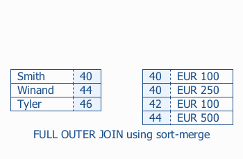

# The Join Operation

## The Join Operation

> Source: https://use-the-index-luke.com/sql/join

> ```
> An SQL query walks into a bar and sees two tables.
> He walks up to them and asks “Can I join you?”
> ```
>
> — Source: Unknown

The join operation transforms data from a normalized model into a denormalized form that suits a specific processing purpose. Joining is particularly sensitive to disk seek latencies because it combines scattered data fragments. Proper indexing is again the best solution to reduce response times. The correct index however depends on which of the three common join algorithms is used for the query.

#### If you like this page, you might also like …

… to [subscribe my **mailing lists**](https://winand.at/lists), [get **free stickers**](https://use-the-index-luke.com/shop), [buy **my book**](https://sql-performance-explained.com/?utm_source=use-the-index-luke.com&utm_campaign=ch-join&utm_medium=web) or [join a **training**](https://winand.at/sql-training/open-online-class).

There is, however, one thing that is common to all join algorithms: they process only two tables at a time. A SQL query with more tables requires multiple steps: first building an intermediate result set by joining two tables, then joining the result with the next table and so forth.

## Pipelining Intermediate Results

Although intermediate results explain the algorithm very well, it does not mean that the database has to materialize it. That would mean storing the intermediate result of the first join before starting the next one. Instead, databases use [pipelining](https://en.wikipedia.org/wiki/Pipeline_%28computing%29) to reduce memory usage. That means that each row from the intermediate result is immediately *pipelined* to the next join operation—avoiding the need to store the intermediate result set.

Even though the join order has no impact on the final result, it still affects performance. The optimizer will therefore evaluate all possible join order permutations and select the best one. That means that just optimizing a complex statement might become a performance problem. The more tables to join, the more execution plan variants to evaluate—mathematically speaking: n! ([factorial growth](https://en.wikipedia.org/wiki/Factorial)), though this is not a problem when using [bind parameters](https://use-the-index-luke.com/sql/where-clause/bind-parameters).

#### Important

The more complex the statement the more important using [bind parameters](https://use-the-index-luke.com/sql/where-clause/bind-parameters) becomes.

Not using bind parameters is like recompiling a program every time.

## Nested Loops

> Source: https://use-the-index-luke.com/sql/join/nested-loops-join-n1-problem

The nested loops join is the most fundamental join algorithm. It works like using two nested queries: the outer or driving query to fetch the results from one table and a second query *for each row* from the driving query to fetch the corresponding data from the other table.

You can actually use “nested selects” to implement the nested loops algorithm on your own. Nevertheless that is a troublesome approach because network latencies occur on top of disk latencies—making the overall response time even worse. “Nested selects” are still very common because it is easy to implement them without being aware of it. Object-relational mapping (ORM) tools are particularly “helpful” in this respect…to the extent that the so-called *N+1 selects problem* has gained a sad notoriety in the field.

#### If you like this page, you might also like …

… to [subscribe my **mailing lists**](https://winand.at/lists), [get **free stickers**](https://use-the-index-luke.com/shop), [buy **my book**](https://sql-performance-explained.com/?utm_source=use-the-index-luke.com&utm_campaign=sec-nested-loops&utm_medium=web) or [join a **training**](https://winand.at/sql-training/open-online-class).

The following examples show these “accidental nested select” joins produced with different ORM tools. The examples search for employees whose last name starts with `'WIN'` and fetches all `SALES` for these employees.

Java
:   The JPA example uses the [CriteriaBuilder](https://docs.oracle.com/javaee/6/api/javax/persistence/criteria/CriteriaBuilder.html) interface.

    ```
    CriteriaBuilder queryBuilder = em.getCriteriaBuilder();
    CriteriaQuery<Employees>
       query = queryBuilder.createQuery(Employees.class);
    Root<Employees> r = query.from(Employees.class); 
    query.where(
      queryBuilder.like(
        queryBuilder.upper(r.get(Employees_.lastName)),
        "WIN%"
      )
    );

    List<Employees> emp = em.createQuery(query).getResultList();

    for (Employees e: emp) {
      // process Employee
      for (Sales s: e.getSales()) {
        // process sale for Employee
      }
    }
    ```

    Hibernate JPA 3.6.0 generates N+1 `select` queries:

    ```
    select employees0_.subsidiary_id as subsidiary1_0_
           -- MORE COLUMNS
      from employees employees0_ 
     where upper(employees0_.last_name) like ?
    ```

    ```
      select sales0_.subsidiary_id as subsidiary4_0_1_
             -- MORE COLUMNS
        from sales sales0_
       where sales0_.subsidiary_id=? 
         and sales0_.employee_id=?
    ```

    ```
      select sales0_.subsidiary_id as subsidiary4_0_1_
             -- MORE COLUMNS
        from sales sales0_
       where sales0_.subsidiary_id=? 
         and sales0_.employee_id=?
    ```

Perl
:   The following sample demonstrates Perl’s [DBIx::Class](https://metacpan.org/dist/DBIx-Class) framework:

    ```
    my @employees = 
       $schema->resultset('Employees')
              ->search({'UPPER(last_name)' => {-like=>'WIN%'}});

    foreach my $employee (@employees) {
       # process Employee
       foreach my $sale ($employee->sales) {
          # process Sale for Employee
       }
    }
    ```

    DBIx::Class 0.08192 generates N+1 `select` queries:

    ```
    SELECT me.employee_id, me.subsidiary_id
         , me.last_name, me.first_name, me.date_of_birth 
      FROM employees me 
     WHERE ( UPPER(last_name) LIKE ? )
    ```

    ```
       SELECT me.sale_id, me.employee_id, me.subsidiary_id
            , me.sale_date, me.eur_value
         FROM sales me
        WHERE ( ( me.employee_id = ? 
          AND me.subsidiary_id = ? ) )
    ```

    ```
       SELECT me.sale_id, me.employee_id, me.subsidiary_id
            , me.sale_date, me.eur_value
         FROM sales me
        WHERE ( ( me.employee_id = ? 
          AND me.subsidiary_id = ? ) )
    ```

PHP
:   The [Doctrine](https://www.doctrine-project.org/) sample uses the query builder interface:

    ```
    $qb = $em->createQueryBuilder();
    $qb->select('e')
       ->from('Employees', 'e')
       ->where("upper(e.last_name) like :last_name")
       ->setParameter('last_name', 'WIN%');
    $r = $qb->getQuery()->getResult();
    foreach ($r as $row) {
       // process Employee
       foreach ($row->getSales() as $sale) {
          // process Sale for Employee
       }
    }
    ```

    Doctrine 2.0.5 generates N+1 `select` queries:

    ```
    SELECT e0_.employee_id AS employee_id0 -- MORE COLUMNS
      FROM employees e0_
     WHERE UPPER(e0_.last_name) LIKE ?
    ```

    ```
       SELECT t0.sale_id AS SALE_ID1 -- MORE COLUMNS
         FROM sales t0 
        WHERE t0.subsidiary_id = ? 
          AND t0.employee_id = ?
    ```

    ```
       SELECT t0.sale_id AS SALE_ID1 -- MORE COLUMNS
         FROM sales t0 
        WHERE t0.subsidiary_id = ? 
          AND t0.employee_id = ?
    ```

The ORMs don’t generate SQL joins—instead they query the `SALES` table with nested selects. This effect is known as the “N+1 selects problem” or shorter the “N+1 problem” because it executes N+1 selects in total if the driving query returns N rows.

#### Enabling SQL Logging

Enable SQL logging during development and review the generated SQL statements.

[DBIx::Class](https://metacpan.org/release/RIBASUSHI/DBIx-Class-0.082840/view/lib/DBIx/Class/Manual/FAQ.pod#misc)
:   `export DBIC_TRACE=1` in your shell.

[Doctrine](https://www.doctrine-project.org/projects/doctrine-orm/en/latest/reference/advanced-configuration.html#sql-logger-optional)
:   Only on source code level—don’t forget to disable this for production. Consider building your own configurable logger.

    ```
    $logger = new \Doctrine\DBAL\Logging\EchoSqlLogger;
    $config->setSQLLogger($logger);
    ```

Hibernate (native)
:   `<property name="show_sql">true</property>` in `App.config` or `hibernate.cfg.xml`

JPA
:   In `persistence.xml` but depending on the JPA provider—e.g., for [eclipselink](https://wiki.eclipse.org/EclipseLink/Examples/JPA/Logging), [Hibernate](https://docs.hibernate.org/orm/current/userguide/html_single/#_sql_statement_logging) and [OpenJPA](https://openjpa.apache.org/builds/3.2.2/apache-openjpa/docs/#ref_guide_logging):

    ```
    <property name="eclipselink.logging.level" value="FINE"/>
    <property name="hibernate.show_sql" value="TRUE"/>
    <property name="openjpa.Log" value="SQL=TRACE"/>
    ```

Most ORMs offer a programmatic way to enable SQL logging as well. That involves the risk of accidentally deploying the setting in production.

Even though the “nested selects” approach is an anti-pattern, it still explains the *nested loops* join pretty well. The database executes the join exactly as the ORM tools above. Indexing for a nested loops join is therefore like indexing for the above shown `select` statements. That is a [function-based index](https://use-the-index-luke.com/sql/where-clause/functions) on the table `EMPLOYEES` and a [concatenated index](https://use-the-index-luke.com/sql/where-clause/the-equals-operator/concatenated-keys) for the join predicates on the `SALES` table:

```
CREATE INDEX emp_up_name ON employees (UPPER(last_name))
```

```
CREATE INDEX sales_emp ON sales (subsidiary_id, employee_id)
```

An SQL join is still more efficient than the nested selects approach—even though it performs the same index lookups—because it avoids a lot of network communication. It is even faster if the total amount of transferred data is bigger because of the duplication of employee attributes for each sale. That is because of the two dimensions of performance: [response time and throughput](https://use-the-index-luke.com/sql/testing-scalability/response-time-throughput-scaling-horizontal); in computer networks we call them *latency* and *bandwidth*. Bandwidth has only a minor impact on the response time but latencies have a huge impact. That means that the number of database round trips is more important for the response time than the amount of data transferred.

#### Tip

Execute joins in the database.

Most ORM tools offer some way to create SQL joins. The so-called *eager fetching* mode is probably the most important one. It is typically configured at the property level in the entity mappings—e.g., for the `employees` property in the `Sales` class. The ORM tool will then always join the `EMPLOYEES` table when accessing the `SALES` table. Configuring eager fetching in the entity mappings only makes sense if you always need the employee details along with the sales data.

Eager fetching is counterproductive if you do not need the child records every time you access the parent object. For a telephone directory application, it does not make sense to load the `SALES` records when showing employee details. You might need the related sales data in other cases—but not always. A static configuration is no solution.

For optimal performance, you need to gain full control over joins. The following examples show how to get the greatest flexibility by controlling the join behavior at runtime.

Java
:   The JPA [`CriteriaBuilder`](https://docs.oracle.com/javaee/6/api/javax/persistence/criteria/CriteriaBuilder.html) interface provides the `Root<>.fetch()` method for controlling joins. It allows you to specify when and how to join referred objects to the main query. In this example we use a left join to retrieve all employees even if some of them do not have sales.

    #### Warning

    JPA and Hibernate return the employees *for each sale.*

    That means that an employee with 30 sales will appear 30 times. Although it is very disturbing, it is the specified behavior ([EJB 3.0 persistency, paragraph 4.4.5.3 “Fetch Joins”](https://download.oracle.com/otndocs/jcp/ejb-3_0-fr-eval-oth-JSpec/)). You can either manually de-duplicate the parent relation e.g. using a [`LinkedHashSet`](https://developer.jboss.org/docs/DOC-15782#jive_content_id_Hibernate_does_not_return_distinct_results_for_a_query_with_outer_join_fetching_enabled_for_a_collection_even_if_I_use_the_distinct_keyword) or use the function `distinct()` as shown in the example.

    ```
    CriteriaBuilder qb = em.getCriteriaBuilder();
    CriteriaQuery<Employees> q = qb.createQuery(Employees.class);
    Root<Employees> r = q.from(Employees.class); 
    q.where(queryBuilder.like(
        queryBuilder.upper(r.get(Employees_.lastName)),
        "WIN%")
    );

    r.fetch("sales", JoinType.LEFT);
    // needed to avoid duplication of Employee records
    q.distinct(true);

    List<Employees> emp = em.createQuery(q).getResultList();
    ```

    Hibernate 3.6.0 generates the following SQL statement:

    ```
    select distinct 
           employees0_.subsidiary_id as subsidiary1_0_0_
         , employees0_.employee_id as employee2_0_0_
           -- MORE COLUMNS
         , sales1_.sale_id as sale1_0__
      from employees employees0_
      left outer join sales sales1_ 
              on employees0_.subsidiary_id=sales1_.subsidiary_id
             and employees0_.employee_id=sales1_.employee_id 
     where upper(employees0_.last_name) like ?
    ```

    The query has the expected left join but also an unnecessary `distinct` keyword. Unfortunately, JPA does not provide separate API calls to filter duplicated parent entries without de-duplicating the child records as well. The `distinct` keyword in the SQL query is alarming because most databases will actually filter duplicate records. Only a few databases recognize that the primary keys guarantees uniqueness in that case anyway.

    The native Hibernate API solves the problem on the client side using a result set transformer:

    ```
    Criteria c = session.createCriteria(Employees.class);
    c.add(Restrictions.ilike("lastName", 'Win%'));

    c.setFetchMode("sales", FetchMode.JOIN);
    c.setResultTransformer(Criteria.DISTINCT_ROOT_ENTITY);

    List<Employees> result = c.list();
    ```

    It generates the following query:

    ```
    select this_.subsidiary_id as subsidiary1_0_1_
         , this_.employee_id as employee2_0_1_
           -- MORE this_ columns on employees
         , sales2_.sale_id as sale1_3_
           -- MORE sales2_ columns on sales
      from employees this_ 
      left outer join sales sales2_ 
              on this_.subsidiary_id=sales2_.subsidiary_id 
             and this_.employee_id=sales2_.employee_id 
     where lower(this_.last_name) like ?
    ```

    This method produces straight SQL without unintended clauses. Note that Hibernate uses `lower()` for case-insensitive queries—an important detail for [function-based indexing](https://use-the-index-luke.com/sql/where-clause/functions).

Perl
:   The following example uses Perl’s [DBIx::Class](https://metacpan.org/dist/DBIx-Class) framework:

    ```
    my @employees = 
       $schema->resultset('Employees')
              ->search({ 'UPPER(last_name)' => {-like => 'WIN%'}
                       , {prefetch => ['sales']}
                       });
    ```

    DBIx::Class 0.08192 generates the following SQL statement:

    ```
    SELECT me.employee_id, me.subsidiary_id, me.last_name
           -- MORE COLUMNS
      FROM employees me 
      LEFT JOIN sales sales 
             ON (sales.employee_id   = me.employee_id 
            AND  sales.subsidiary_id = me.subsidiary_id) 
     WHERE ( UPPER(last_name) LIKE ? )
     ORDER BY sales.employee_id, sales.subsidiary_id
    ```

    Note the `order by` clause—it was not requested by the application. The database has to sort the result set accordingly, and that might take a while.

PHP
:   The following example uses PHP’s [Doctrine](https://www.doctrine-project.org/) framework:

    ```
    $qb = $em->createQueryBuilder();
    $qb->select('e,s')
       ->from('Employees', 'e')
       ->leftJoin('e.sales', 's')
       ->where("upper(e.last_name) like :last_name")
       ->setParameter('last_name', 'WIN%');
    $r = $qb->getQuery()->getResult();
    ```

    Doctrine 2.0.5 generates the following SQL statement:

    ```
    SELECT e0_.employee_id AS employee_id0
           -- MORE COLUMNS
      FROM employees e0_ 
      LEFT JOIN sales s1_ 
             ON e0_.subsidiary_id = s1_.subsidiary_id 
            AND e0_.employee_id = s1_.employee_id 
     WHERE UPPER(e0_.last_name) LIKE ?
    ```

The execution plan shows the `NESTED LOOPS OUTER` operation:

Db2 (LUW)
:   ```
    Explain Plan
    ---------------------------------------------------------------
    ID | Operation               |                     Rows |  Cost
     1 | RETURN                  |                          | 10501
     2 |  NLJOIN (LEFT)          |               5745 of 57 | 10501
     3 |   FETCH EMPLOYEES       |       57 of 57 (100.00%) |    49
     4 |    RIDSCN               |       57 of 57 (100.00%) |     6
     5 |     SORT (UNIQUE)       |       57 of 57 (100.00%) |     6
     6 |      IXSCAN EMP_NAME    |    57 of 10000 (   .57%) |     6
     7 |   FETCH SALES           |     101 of 101 (100.00%) |   183
     8 |    IXSCAN SALES_SUB_EMP | 101 of 1011118 (   .01%) |    13

    Predicate Information
     2 - JOIN (Q2.EMPLOYEE_ID = Q3.EMPLOYEE_ID)
         JOIN (Q2.SUBSIDIARY_ID = Q3.SUBSIDIARY_ID)
     3 - SARG (Q1.LAST_NAME LIKE ?)
     6 - START ($INTERNAL_FUNC$() <= Q1.LAST_NAME)
          STOP (Q1.LAST_NAME <= $INTERNAL_FUNC$())
          SARG (Q1.LAST_NAME LIKE ?)
     8 - START (Q2.SUBSIDIARY_ID = Q3.SUBSIDIARY_ID)
         START (Q2.EMPLOYEE_ID = Q3.EMPLOYEE_ID)
          STOP (Q2.SUBSIDIARY_ID = Q3.SUBSIDIARY_ID)
          STOP (Q2.EMPLOYEE_ID = Q3.EMPLOYEE_ID)
    ```

    The `UPPER` was removed from the `where`-clause to get the expected result.

Oracle
:   ```
    ---------------------------------------------------------------
    |Id |Operation                    | Name        | Rows | Cost |
    ---------------------------------------------------------------
    | 0 |SELECT STATEMENT             |             |  822 |   38 |
    | 1 | NESTED LOOPS OUTER          |             |  822 |   38 |
    | 2 |  TABLE ACCESS BY INDEX ROWID| EMPLOYEES   |    1 |    4 |
    |*3 |   INDEX RANGE SCAN          | EMP_UP_NAME |    1 |      |
    | 4 |  TABLE ACCESS BY INDEX ROWID| SALES       |  821 |   34 |
    |*5 |   INDEX RANGE SCAN          | SALES_EMP   |   31 |      |
    ---------------------------------------------------------------

    Predicate Information (identified by operation id):
    ---------------------------------------------------
      3 - access(UPPER("LAST_NAME") LIKE 'WIN%')
          filter(UPPER("LAST_NAME") LIKE 'WIN%')
      5 - access("E0_"."SUBSIDIARY_ID"="S1_"."SUBSIDIARY_ID"(+)
            AND  "E0_"."EMPLOYEE_ID"  ="S1_"."EMPLOYEE_ID"(+))
    ```

The database retrieves the result from the `EMPLOYEES` table via `EMP_UP_NAME` first and fetches the corresponding records from the `SALES` table for each employee afterwards.

#### Tip

Get to know your ORM and take control of joins.

Different ORM tools offer different ways to control join behavior. Eager fetching is just one example that is not even provided by every object-relational mapper. It is good practice to implement a small set of samples that explores the capabilities of your ORM. That’s not only a good exercise, it can also serve as reference during development, and will show you unexpected behavior—like duplication of parent records as a side effect of using joins. [Download the samples](https://use-the-index-luke.com/samples/use-the-index-luke-samples.zip) to get started.

The nested loops join delivers good performance if the driving query returns a small result set. Otherwise, the optimizer might choose an entirely different join algorithm—like the hash join described in the next section, but this is only possible if the application uses a join to tell the database what data it actually needs.

#### Links

- [Complete Java, Perl and PHP samples [ZIP]](https://use-the-index-luke.com/samples/use-the-index-luke-samples.zip)
- [`CREATE` and `INSERT` statements for the samples](https://use-the-index-luke.com/sql/example-schema)
- Article: “[Latency: Security vs. Performance](https://blog.fatalmind.com/2009/12/22/latency-security-vs-performance/)” about network latencies and SQL applications.

## Hash Join

> Source: https://use-the-index-luke.com/sql/join/hash-join-partial-objects

The hash join algorithm aims for the weak spot of the [nested loops join](https://use-the-index-luke.com/sql/join/nested-loops-join-n1-problem): the many B-tree traversals when executing the inner query. Instead it loads the candidate records from one side of the join into a [hash table](https://en.wikipedia.org/wiki/Hash_table) that can be probed very quickly for each row from the other side of the join. Tuning a hash join requires an entirely different indexing approach than the nested loops join. Beyond that, it is also possible to improve hash join performance by selecting fewer *columns*—a challenge for most ORM tools.

The indexing strategy for a hash join is very different because there is no need to index the join columns. Only indexes for *independent* `where` predicates improve hash join performance.

#### Tip

Index the *independent* `where` predicates to improve hash join performance.

Consider the following example. It selects all sales for the past six months with the corresponding employee details:

```
SELECT *
  FROM sales s
  JOIN employees e ON (s.subsidiary_id = e.subsidiary_id
                  AND  s.employee_id   = e.employee_id  )
 WHERE s.sale_date > trunc(sysdate) - INTERVAL '6' MONTH
```

The `SALE_DATE` filter is the only independent `where` clause—that means it refers to one table only and does not belong to the join predicates.

Db2 (LUW)
:   ```
    Explain Plan
    ------------------------------------------------------------
    ID | Operation          |                       Rows |  Cost
     1 | RETURN             |                            | 60750
     2 |  HSJOIN            |             50795 of 10000 | 60750
     3 |   TBSCAN SALES     | 50795 of 1011118 (  5.02%) | 60053
     4 |   TBSCAN EMPLOYEES |   10000 of 10000 (100.00%) |   688

    Predicate Information
     2 - JOIN (Q2.SUBSIDIARY_ID = DECIMAL(Q1.SUBSIDIARY_ID, 10, 0))
         JOIN (Q2.EMPLOYEE_ID = DECIMAL(Q1.EMPLOYEE_ID, 10, 0))
     3 - SARG ((CURRENT DATE - 6 MONTHS) < Q2.SALE_DATE)
    ```

    The `where` clause was changed like this to get the desired result: `WHERE s.sale_date > current_date - 6 MONTH`.

Oracle
:   ```
    --------------------------------------------------------------
    | Id | Operation          | Name      | Rows  | Bytes | Cost |
    --------------------------------------------------------------
    |  0 | SELECT STATEMENT   |           | 49244 |    59M| 12049|
    |* 1 |  HASH JOIN         |           | 49244 |    59M| 12049|
    |  2 |   TABLE ACCESS FULL| EMPLOYEES | 10000 |     9M|   478|
    |* 3 |   TABLE ACCESS FULL| SALES     | 49244 |    10M| 10521|
    --------------------------------------------------------------

    Predicate Information (identified by operation id):
    ---------------------------------------------------
       1 - access("S"."SUBSIDIARY_ID"="E"."SUBSIDIARY_ID"
              AND "S"."EMPLOYEE_ID"  ="E"."EMPLOYEE_ID")
       3 - filter("S"."SALE_DATE">TRUNC(SYSDATE@!)
                               -INTERVAL'+00-06' YEAR(2) TO MONTH)
    ```

The first execution step is a full table scan to load all employees into a hash table (plan id 2). The hash table uses the join predicates as key. In the next step, the database does another full table scan on the `SALES` table and discards all sales that do not satisfy the condition on `SALE_DATE` (plan id 3). For the remaining `SALES` records, the database accesses the hash table to load the corresponding employee details.

#### If you like this page, you might also like …

… to [subscribe my **mailing lists**](https://winand.at/lists), [get **free stickers**](https://use-the-index-luke.com/shop), [buy **my book**](https://sql-performance-explained.com/?utm_source=use-the-index-luke.com&utm_campaign=sec-hash-join&utm_medium=web) or [join a **training**](https://winand.at/sql-training/open-online-class).

The sole purpose of the hash table is to act as a temporary in-memory structure to avoid accessing the `EMPLOYEE` table many times. The hash table is initially loaded in one shot so that there is no need for an index to efficiently fetch single records. The predicate information confirms that not a single filter is applied on the `EMPLOYEES` table (plan id 2). The query doesn’t have any independent predicates on this table.

#### Important

Indexing join predicates doesn’t improve hash join performance.

That does not mean it is impossible to index a hash join. The independent predicates can be indexed. These are the conditions which are applied during one of the two table access operations. In the above example, it is the filter on `SALE_DATE`.

```
CREATE INDEX sales_date ON sales (sale_date)
```

The following execution plan uses this index. Nevertheless it uses a full table scan for the `EMPLOYEES` table because the query has no independent `where` predicate on `EMPLOYEES`.

Db2 (LUW)
:   ```
    Explain Plan
    ----------------------------------------------------------------
    ID | Operation              |                       Rows |  Cost
     1 | RETURN                 |                            | 16655
     2 |  HSJOIN                |             50795 of 10000 | 16655
     3 |   FETCH SALES          |   50795 of 50795 (100.00%) | 15958
     4 |    RIDSCN              |   50795 of 50795 (100.00%) |  1655
     5 |     SORT (UNIQUE)      |   50795 of 50795 (100.00%) |  1655
     6 |      IXSCAN SALES_DATE | 50795 of 1011118 (  5.02%) |  1631
     7 |   TBSCAN EMPLOYEES     |   10000 of 10000 (100.00%) |   688

    Predicate Information
     2 - JOIN (Q2.SUBSIDIARY_ID = DECIMAL(Q1.SUBSIDIARY_ID, 10, 0))
         JOIN (Q2.EMPLOYEE_ID = DECIMAL(Q1.EMPLOYEE_ID, 10, 0))
     3 - SARG ((CURRENT DATE - 6 MONTHS) < Q2.SALE_DATE)
     6 - START ((CURRENT DATE - 6 MONTHS) < Q2.SALE_DATE)
    ```

    The `where` clause was changed like this to get the desired result: `WHERE s.sale_date > current_date - 6 MONTH`.

Oracle
:   ```
    --------------------------------------------------------------
    | Id | Operation                    | Name      | Bytes| Cost|
    --------------------------------------------------------------
    |  0 | SELECT STATEMENT             |           |   59M| 3252|
    |* 1 |  HASH JOIN                   |           |   59M| 3252|
    |  2 |   TABLE ACCESS FULL          | EMPLOYEES |    9M|  478|
    |  3 |   TABLE ACCESS BY INDEX ROWID| SALES     |   10M| 1724|
    |* 4 |    INDEX RANGE SCAN          | SALES_DATE|      |     |
    --------------------------------------------------------------

    Predicate Information (identified by operation id):
    ---------------------------------------------------
       1 - access("S"."SUBSIDIARY_ID"="E"."SUBSIDIARY_ID"
              AND "S"."EMPLOYEE_ID"  ="E"."EMPLOYEE_ID"  )
       4 - access("S"."SALE_DATE" > TRUNC(SYSDATE@!)
                               -INTERVAL'+00-06' YEAR(2) TO MONTH)
    ```

Indexing a hash join is—contrary to the [nested loops join](https://use-the-index-luke.com/sql/join/nested-loops-join-n1-problem)—symmetric. That means that the join order does not influence indexing. The `SALES_DATE` index can be used to load the hash table if the join order is reversed.

#### Note

Indexing a hash join is independent of the join order.

A rather different approach to optimizing hash join performance is to minimize the hash table size. This method works because an optimal hash join is only possible if the entire hash table fits into memory. The optimizer will therefore automatically use the smaller side of the join for the hash table. The Oracle execution plan shows the estimated memory requirement in the “Bytes” column. In the above execution plan, the `EMPLOYEES` table needs nine megabytes and is thus the smaller one.

It is also possible to reduce the hash table size by changing the SQL query, for example by adding extra conditions so that the database loads fewer candidate records into the hash table. Continuing the above example it would mean adding a filter on the `DEPARTMENT` attribute so only sales staff is considered. This improves hash join performance even if there is no index on the `DEPARTMENT` attribute because the database does not need to store employees who cannot have sales in the hash table. When doing so you have to make sure there are no `SALES` records for employees that do not work in the respective department. Use constraints to guard your assumptions.

When minimizing the hash table size, the relevant factor is not the number of rows but the memory footprint. It is, in fact, also possible to reduce the hash table size by selecting fewer *columns*—only the attributes you really need:

```
SELECT s.sale_date, s.eur_value
     , e.last_name, e.first_name
  FROM sales s
  JOIN employees e ON (s.subsidiary_id = e.subsidiary_id
                  AND  s.employee_id   = e.employee_id  )
 WHERE s.sale_date > trunc(sysdate) - INTERVAL '6' MONTH
```

That method seldom introduces bugs because dropping the wrong column will probably quickly result in an error message. Nevertheless it is possible to cut the hash table size considerably, in this particular case from 9 megabyte down to 234 kilobytes—a reduction of 97%.

```
--------------------------------------------------------------
| Id | Operation                    | Name      | Bytes| Cost|
--------------------------------------------------------------
|  0 | SELECT STATEMENT             |           | 2067K| 2202|
|* 1 |  HASH JOIN                   |           | 2067K| 2202|
|  2 |   TABLE ACCESS FULL          | EMPLOYEES |  234K|  478|
|  3 |   TABLE ACCESS BY INDEX ROWID| SALES     |  913K| 1724|
|* 4 |    INDEX RANGE SCAN          | SALES_DATE|      |  133|
--------------------------------------------------------------
```

#### Tip

Select fewer columns to improve hash join performance.

Although at first glance it seems simple to remove a few columns from an SQL statement, it is a real challenge when using an object-relational mapping (ORM) tool. Support for so-called *partial objects* is very sparse. The following examples show some possibilities.

Java
:   JPA defines the `FetchType.LAZY` in the `@Basic` annotation. It can be applied on property level:

    ```
    @Column(name="junk")
    @Basic(fetch=FetchType.LAZY)
    private String junk;
    ```

    JPA providers are free to ignore it:

    > The LAZY strategy is a hint to the persistence provider runtime that data should be fetched lazily when it is first accessed. The implementation is permitted to eagerly fetch data for which the LAZY strategy hint has been specified.
    >
    > — [EJB 3.0 JPA, paragraph 9.1.18](https://download.oracle.com/otndocs/jcp/ejb-3_0-fr-eval-oth-JSpec/)

    Hibernate 3.6 implements lazy property fetching via [compile time bytecode instrumentation](https://docs.hibernate.org/orm/6.2/userguide/html_single/#BytecodeEnhancement-lazy-loading). The instrumentation adds extra code to the compiled classes that does not fetch the `LAZY` properties until accessed. The approach is fully transparent to the application but it opens the door to a new dimension of [N+1 problems](https://use-the-index-luke.com/sql/join/nested-loops-join-n1-problem): one `select` for each record *and property*. This is particularly dangerous because JPA does not offer runtime control to fetch eagerly if needed.

    Hibernate’s native query language HQL solves the problem with the `FETCH ALL PROPERTIES` clause (see [`FewerColumnsInstrumentedHibernate.java`](https://use-the-index-luke.com/samples/use-the-index-luke-samples.zip)):

    ```
    select s from Sales s FETCH ALL PROPERTIES
     inner join fetch s.employee e FETCH ALL PROPERTIES
     where s.saleDate >:dt
    ```

    The `FETCH ALL PROPERTIES` clause forces Hibernate to eagerly fetch the entity—even when using instrumented code and the `LAZY` annotation.

    Another option for loading only selected columns is to use data transport objects (DTOs) instead of entities. This method works the same way in HQL and JPQL, that is you initialize an object in the query ([`FewerColumnsJPA.java`](https://use-the-index-luke.com/samples/use-the-index-luke-samples.zip) sample):

    ```
    select new SalesHeadDTO(s.saleDate , s.eurValue
                           ,e.firstName, e.lastName)
      from Sales s
      join s.employee e
     where s.saleDate > :dt
    ```

    The query selects the requested data only and returns a `SalesHeadDTO` object—a simple Java object ([POJO](https://en.wikipedia.org/wiki/Plain_Old_Java_Object)), not an entity.

    Solving a real world performance problem does often involve a lot of existing code. Migrating that code to new classes is probably unreasonable. But byte-code instrumentation causes N+1 problems, which is likely worse than the original performance issue. The [`FewerColumnsJPA.java`](https://use-the-index-luke.com/samples/use-the-index-luke-samples.zip) example uses a common interface for the entity and the DTO to solve the problem. The interface defines the getter methods only so that a read-only consumer can easily be changed to accept the the DTO as input. That is often sufficient because large hash joins are usually triggered by reporting procedures that do not update anything.

    If you are building a new report, you could consider fetching the data via DTOs or a simple `Map`, like demonstrated in the [`FewerColumnsHibernate.java`](https://use-the-index-luke.com/samples/use-the-index-luke-samples.zip) sample.

Perl
:   The DBIx::Class framework does not act as entity manager so that inheritance doesn’t cause [aliasing problems](https://en.wikipedia.org/wiki/Aliasing_%28computing%29). The [cookbook](https://metacpan.org/release/RIBASUSHI/DBIx-Class-0.082840/view/lib/DBIx/Class/Manual/Cookbook.pod#Static_sub-classing_DBIx::Class_result_classes) supports this approach. The following schema definition defines the `Sales` class on two levels:

    ```
    package UseTheIndexLuke::Schema::Result::SalesHead;
    use base qw/DBIx::Class::Core/;

    __PACKAGE__->table('sales');
    __PACKAGE__->add_columns(qw/sale_id employee_id subsidiary_id
                                sale_date eur_value/);
    __PACKAGE__->set_primary_key(qw/sale_id/);
    __PACKAGE__->belongs_to('employee', 'Employees', 
               {'foreign.employee_id'   => 'self.employee_id'
               ,'foreign.subsidiary_id' => 'self.subsidiary_id'});

    package UseTheIndexLuke::Schema::Result::Sales;
    use base qw/UseTheIndexLuke::Schema::Result::SalesHead/;

    __PACKAGE__->table('sales');
    __PACKAGE__->add_columns(qw/junk/);
    ```

    The `Sales` class is derived from the `SalesHead` class and adds the missing attribute. You can use both classes as you need them. Please note that the table setup is required in the derived class as well.

    You can fetch all employee details via [prefetch](https://use-the-index-luke.com/sql/join/nested-loops-join-n1-problem#orm-join) or just selected columns as shown below:

    ```
    my @sales =
       $schema->resultset('SalesHead')
              ->search($cond
                      ,{      join => 'employee'
                       ,'+columns' => ['employee.first_name'
                                      ,'employee.last_name']
                       }
                      );
    ```

    It is not possible to load only selected columns from the root table—`SalesHead` in this case.

    DBIx::Class 0.08192 generates the following SQL. It fetches all columns from the `SALES` table and the selected attributes from `EMPLOYEES`:

    ```
    SELECT me.sale_id,
           me.employee_id,
           me.subsidiary_id,
           me.sale_date,
           me.eur_value,
           employee.first_name,
           employee.last_name
      FROM sales me
      JOIN employees employee
            ON( employee.employee_id   = me.employee_id
           AND  employee.subsidiary_id = me.subsidiary_id)
     WHERE(sale_date > ?)
    ```

PHP
:   Version 2 of the Doctrine framework supports attribute selection at runtime. The documentation states that the [partially loaded objects](https://www.doctrine-project.org/projects/doctrine-orm/en/latest/reference/partial-objects.html) might behave oddly and requires the `partial` keyword to acknowledge the risks. Furthermore, you must select the primary key columns explicitly:

    ```
    $qb = $em->createQueryBuilder();
    $qb->select('partial s.{sale_id, sale_date, eur_value},'
              . 'partial e.{employee_id, subsidiary_id, '
                         . 'first_name , last_name}')
       ->from('Sales', 's')
       ->join('s.employee', 'e')
       ->where("s.sale_date > :dt")
       ->setParameter('dt', $dt, Type::DATETIME);
    ```

    The generated SQL contains the requested columns and once more the `SUBSIDIARY_ID` and `EMPLOYEE_ID` from the `SALES` table.

    ```
    SELECT s0_.sale_id       AS sale_id0,
           s0_.sale_date     AS sale_date1,
           s0_.eur_value     AS eur_value2,
           e1_.employee_id   AS employee_id3,
           e1_.subsidiary_id AS subsidiary_id4,
           e1_.first_name    AS first_name5,
           e1_.last_name     AS last_name6,
           s0_.subsidiary_id AS subsidiary_id7,
           s0_.employee_id   AS employee_id8
      FROM sales s0_
     INNER JOIN employees e1_
             ON s0_.subsidiary_id = e1_.subsidiary_id
            AND s0_.employee_id   = e1_.employee_id
     WHERE s0_.sale_date > ?
    ```

    The returned objects are compatible with fully loaded objects, but the missing columns remain uninitialized. Accessing them does *not* trigger an exception.

#### Note

MySQL introduced the hash join with version 8.0.18 in 2019.

#### Factbox

- Hash joins do not need indexes on the join predicates. They use the hash table instead.
- A hash join uses indexes only if the index supports the independent predicates.
- Reduce the hash table size to improve performance; either horizontally (less rows) or vertically (less columns).
- Hash joins cannot perform joins that have range conditions in the join predicates ([theta joins](https://en.wikipedia.org/wiki/Join_(relational_algebra)#%CE%B8-join_and_equijoin)).

#### Links

- [Complete Java, Perl and PHP samples [ZIP]](https://use-the-index-luke.com/samples/use-the-index-luke-samples.zip)
- [`CREATE` and `INSERT` statements for the samples](https://use-the-index-luke.com/sql/example-schema)

## Sort-Merge Join

> Source: https://use-the-index-luke.com/sql/join/sort-merge-join

The sort-merge join combines two sorted lists like a zipper. Both sides of the join must be sorted by the join predicates.

A sort-merge join needs the same indexes as the [hash join](https://use-the-index-luke.com/sql/join/hash-join-partial-objects), that is an index for the independent conditions to read all candidate records in one shot. Indexing the join predicates is useless. Everything is just like a hash join so far. Nevertheless there is one aspect that is unique to the sort-merge join: absolute symmetry. The join order does not make any difference—not even for performance. This property is very useful for outer joins. For other algorithms the direction of the outer joins (left or right) implies the join order—but not for the sort-merge join. The sort-merge join can even do a left and right outer join at the same time—a so-called full outer join, like shown in the following animation.

## Figure 4.1 Sort-Merge Join Executing a FULL OUTER JOIN



Although the sort-merge join performs very well once the inputs are sorted, it is hardly used because sorting both sides is very expensive. The hash join, on the other hand, needs to preprocess only one side.

#### If you like this page, you might also like …

… to [subscribe my **mailing lists**](https://winand.at/lists), [get **free stickers**](https://use-the-index-luke.com/shop), [buy **my book**](https://sql-performance-explained.com/?utm_source=use-the-index-luke.com&utm_campaign=sec-sort-merge&utm_medium=web) or [join a **training**](https://winand.at/sql-training/open-online-class).

The strength of the sort-merge join emerges if the inputs are already sorted. This is possible by exploiting the index order to avoid the sort operations entirely. [Chapter 6, “*Sorting and Grouping*”](https://use-the-index-luke.com/sql/sorting-grouping), explains this concept in detail. The hash join algorithm is superior in many cases nevertheless.

#### Factbox

- Sort-merge joins do not need indexes on the join predicates.
- MySQL does not support sort-merge joins at all.
