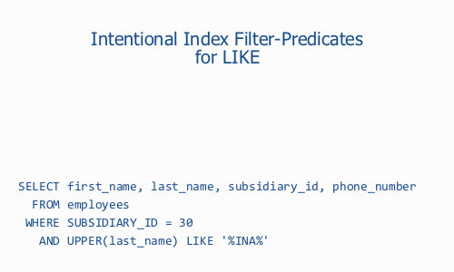

# Clustering Data

## Clustering Data

> Source: https://use-the-index-luke.com/sql/clustering

The term *cluster* is used in various fields. A [star cluster](https://en.wikipedia.org/wiki/Star_cluster), for example, is a group of stars. A [computer cluster](https://en.wikipedia.org/wiki/Computer_cluster), on the other hand, is a group of computers that work closely together—either to solve a complex problem (high-performance computing cluster) or to increase availability (failover cluster). Generally speaking, clusters are related things that appear together.

In the field of computing there is one more type of cluster—one that is often misunderstood: the data cluster. Clustering data means to store consecutively accessed data closely together so that accessing it requires fewer IO operations. Data clusters are very important in terms of database tuning. Computer clusters, on the other hand, are also very common in a database context—thus making the term *cluster* very ambiguous. The sentence “Let’s use a cluster to improve database performance” is just one example; it might refer to a computer cluster but could also mean a data cluster. In this chapter, cluster generally refers to *data clusters*.

#### If you like this page, you might also like …

… to [subscribe my **mailing lists**](https://winand.at/lists), [get **free stickers**](https://use-the-index-luke.com/shop), [buy **my book**](https://sql-performance-explained.com/?utm_source=use-the-index-luke.com&utm_campaign=ch-clustering&utm_medium=web) or [join a **training**](https://winand.at/sql-training/open-online-class).

The simplest data cluster in an SQL database is the row. Databases store all columns of a row in the same database block if possible. Exceptions apply if a row doesn’t fit into a single block—e.g., when LOB types are involved.

## Column Stores

[Column oriented databases](https://en.wikipedia.org/wiki/Column-oriented_DBMS), or column-stores, organize tables in a columned way. This model is beneficial when accessing many rows but only a few columns—a pattern that is very common in data warehouses (OLAP).

Indexes allow one to cluster data. The basis for this was already explained in [Chapter 1, “*Anatomy of an SQL Index*”](https://use-the-index-luke.com/sql/anatomy): the index leaf nodes store the indexed columns in an ordered fashion so that similar values are stored next to each other. That means that indexes build clusters of rows with similar values. This capability to cluster data is so important that I refer to it as the *second power of indexing*.

#### Note

The [B-tree traversal](https://use-the-index-luke.com/sql/anatomy/the-tree) is the first power of indexing.

Clustering is the second power of indexing.

The following sections explain how to use indexes to cluster data and improve query performance.

## Index Filter Predicates Intentionally Used

> Source: https://use-the-index-luke.com/sql/clustering/index-filter-predicates

Very often index [filter predicates](https://use-the-index-luke.com/sql/glossary/index-filter-predicates) indicate improper index usage caused by an incorrect column order in a concatenated index. Nevertheless index filter predicates can be used for a good reason as well—not to improve range scan performance but to group consecutively accessed data together.

`Where` clause predicates that cannot serve as access predicate are good candidates for this technique:

```
SELECT first_name, last_name, subsidiary_id, phone_number
  FROM employees
 WHERE subsidiary_id = ?
   AND UPPER(last_name) LIKE '%INA%'
```

Remember that `LIKE` expressions with leading wildcards [cannot use the index tree](https://use-the-index-luke.com/sql/where-clause/searching-for-ranges/like-performance-tuning). That means that indexing `LAST_NAME` doesn’t narrow the scanned index range—no matter if you index `LAST_NAME` or `UPPER(last_name)`. This condition is therefore no good candidate for indexing.

#### If you like this page, you might also like …

… to [subscribe my **mailing lists**](https://winand.at/lists), [get **free stickers**](https://use-the-index-luke.com/shop), [buy **my book**](https://sql-performance-explained.com/?utm_source=use-the-index-luke.com&utm_campaign=sec-intentional-index-filter&utm_medium=web) or [join a **training**](https://winand.at/sql-training/open-online-class).

However the condition on `SUBSIDIARY_ID` is well suited for indexing. We don’t even need to add a new index because the `SUBSIDIARY_ID` is already the leading column in the index for the primary key.

Db2 (LUW)
:   ```
    Explain Plan
    ------------------------------------------------------------
    ID | Operation               |                   Rows | Cost
     1 | RETURN                  |                        |   40
     2 |  FETCH EMPLOYEES        |    33 of 333 (  9.91%) |   40
     3 |   RIDSCN                |   333 of 333 (100.00%) |   12
     4 |    SORT (UNIQUE)        |   333 of 333 (100.00%) |   12
     5 |     IXSCAN EMPLOYEES_PK | 333 of 10000 (  3.33%) |   12

    Predicate Information
     2 - SARG (Q1.SUBSIDIARY_ID = ?)
         SARG ( UPPER(Q1.LAST_NAME) LIKE '%INA%')
     5 - START (Q1.SUBSIDIARY_ID = ?)
          STOP (Q1.SUBSIDIARY_ID = ?)
    ```

Oracle
:   ```
    ---------------------------------------------------------------
    |Id | Operation                   | Name        | Rows | Cost |
    ---------------------------------------------------------------
    | 0 | SELECT STATEMENT            |             |   17 |  230 |
    |*1 |  TABLE ACCESS BY INDEX ROWID| EMPLOYEES   |   17 |  230 |
    |*2 |   INDEX RANGE SCAN          | EMPLOYEEs_PK|  333 |    2 |
    ---------------------------------------------------------------

    Predicate Information (identified by operation id):
    ---------------------------------------------------
       1 - filter(UPPER("LAST_NAME") LIKE '%INA%')
       2 - access("SUBSIDIARY_ID"=TO_NUMBER(:A))
    ```

In the above execution plan, the cost value raises a hundred times from the `INDEX RANGE SCAN` to the subsequent `TABLE ACCESS BY INDEX ROWID` operation. In other words: the table access causes the most work. It is actually a common pattern and is not a problem by itself. Nevertheless, it is the most significant contributor to the overall execution time of this query.

The table access is not necessarily a bottleneck if the accessed rows are stored in a single table block because the database can fetch all rows with a single read operation. If the same rows are spread across many different blocks, in contrast, the table access can become a serious performance problem because the database has to fetch many blocks in order to retrieve all the rows. That means the performance depends on the physical distribution of the accessed rows—in other words: it depends on the clustering of rows.

#### Note

The correlation between index order and table order is a performance benchmark—the so-called [*index clustering factor*](#sb-clustering-factor).

It is in fact possible to improve query performance by re-ordering the rows in the table so they correspond to the index order. This method is, however, rarely applicable because you can only store the table rows in one sequence. That means you can optimize the table for one index only. Even if you can choose a single index for which you would like to optimize the table, it is still a difficult task because most databases only offer rudimentary tools for this task. So-called *row sequencing* is, after all, a rather impractical approach.

## The Index Clustering Factor

The index clustering factor is an indirect measure of the probability that two succeeding index entries refer to the same table block. The optimizer takes this probability into account when calculating the cost value of the `TABLE ACCESS BY INDEX ROWID` operation.

This is exactly where the *second power of indexing*—clustering data—comes in. You can add many columns to an index so that they are automatically stored in a well defined order. That makes an index a powerful yet simple tool for clustering data.

To apply this concept to the above query, we must extend the index to cover all columns from the `where` clause—even if they do not narrow the scanned index range:

```
CREATE INDEX empsubupnam ON employees
       (subsidiary_id, UPPER(last_name))
```

The column `SUBSIDIARY_ID` is the first index column so it can be used as an access predicate. The expression `UPPER(last_name)` covers the `LIKE` filter as *index filter predicate*. Indexing the uppercase representation saves a few CPU cycles during execution, but a straight index on `LAST_NAME` would work as well. You’ll find more about this in the next section.

Db2 (LUW)
:   ```
    Explain Plan
    --------------------------------------------------------
    ID | Operation             |                 Rows | Cost
     1 | RETURN                |                      |   15
     2 |  FETCH EMPLOYEES      |               0 of 0 |   15
     3 |   IXSCAN EMPSUBUPNAM2 | 0 of 10000 (   .00%) |   15

    Predicate Information
     3 - START (Q1.SUBSIDIARY_ID = ?)
          STOP (Q1.SUBSIDIARY_ID = ?)
          SARG (Q1.LAST_NAME LIKE '%INA%')
    ```

    To get the desired execution plan, I had to remove the `UPPER` from the index and the `where`-clause. As of Db2 (LUW) 10.5, function based indexing is a pretty fresh feature—it seems that the optimizer is not yet fully aware of it. Further, using appropriate collations to get case-insensitive behaviour is anyway the better option in Db2.

Oracle
:   ```
    --------------------------------------------------------------
    |Id | Operation                   | Name       | Rows | Cost |
    --------------------------------------------------------------
    | 0 | SELECT STATEMENT            |            |   17 |   20 |
    | 1 |  TABLE ACCESS BY INDEX ROWID| EMPLOYEES  |   17 |   20 |
    |*2 |   INDEX RANGE SCAN          | EMPSUBUPNAM|   17 |    3 |
    --------------------------------------------------------------

    Predicate Information (identified by operation id):
    ---------------------------------------------------
       2 - access("SUBSIDIARY_ID"=TO_NUMBER(:A))
           filter(UPPER("LAST_NAME") LIKE '%INA%')
    ```

The new execution plan shows the very same operations as before. The cost value dropped considerably nonetheless. In the predicate information we can see that the `LIKE` filter is already applied during the `INDEX RANGE SCAN`. Rows that do not fulfill the `LIKE` filter are immediately discarded. The table access does not have any filter predicates anymore. That means it does not load rows that do not fulfill the `where` clause.

The difference between the two execution plans is clearly visible in the “Rows” column. According to the optimizer’s estimate, the query ultimately matches 17 records. The index scan in the first execution plan delivers 333 rows nevertheless. The database must then load these 333 rows from the table to apply the `LIKE` filter which reduces the result to 17 rows. In the second execution plan, the index access does not deliver those rows in the first place so the database needs to execute the `TABLE ACCESS BY INDEX ROWID` operation only 17 times.

You should also note that the cost value of the `INDEX RANGE SCAN` operation grew from two to three because the additional column makes the index bigger. In view of the performance gain, it is an acceptable compromise.

#### Warning

Don’t introduce a new index for the sole purpose of filter predicates. Extend an existing index instead and keep the [maintenance effort](https://use-the-index-luke.com/sql/dml) low. With some databases you can even add columns to the index for the primary key that are not part of the primary key.

The following animation demonstrates the difference between the two execution plans:

## Figure 5.1 Intentional Index Filter-Predicates



This trivial example seems to confirm the common wisdom to index every column from the `where` clause. This “wisdom”, however, ignores the relevance of the column order which determines what conditions can be used as access predicates and thus has a huge impact on performance. The decision about column order should therefore never be left to chance.

The index size grows with the number of columns as well—especially when adding text columns. Of course the performance does not get better for a bigger index even though the [logarithmic scalability](https://use-the-index-luke.com/sql/anatomy/the-tree#sb-log) limits the impact considerably. You should by no means add all columns that are mentioned in the `where` clause to an index but instead only use index filter predicates intentionally to reduce the data volume during an earlier execution step.

#### Tip

- Glossary: [Index filter predicates](https://use-the-index-luke.com/sql/glossary/index-filter-predicates)
- [Index access and filter predicates explained by example](https://use-the-index-luke.com/sql/where-clause/searching-for-ranges/greater-less-between-tuning-sql-access-filter-predicates)
- [The impact of accidental index filter predicates demonstrated](https://use-the-index-luke.com/sql/testing-scalability/data-volume)
- [Why “anywhere” `LIKE` searches aren’t access predicates](https://use-the-index-luke.com/sql/where-clause/searching-for-ranges/like-performance-tuning)
- Spotting index filter predicates in [Oracle](https://use-the-index-luke.com/sql/explain-plan/oracle/filter-predicates), [PostgreSQL](https://use-the-index-luke.com/sql/explain-plan/postgresql/filter-predicates) and [SQL Server](https://use-the-index-luke.com/sql/explain-plan/oracle/filter-predicates) execution plans.

## Index-Only Scan

> Source: https://use-the-index-luke.com/sql/clustering/index-only-scan-covering-index

The index-only scan is one of the most powerful tuning methods of all. It not only avoids accessing the table to evaluate the `where` clause, but avoids accessing the table completely if the database can find the selected columns in the index itself.

To cover an entire query, an index must contain *all* columns from the SQL statement—in particular also the columns from the `select` clause as shown in the following example:

```
CREATE INDEX sales_sub_eur
    ON sales
     ( subsidiary_id, eur_value )
```

```
SELECT SUM(eur_value)
  FROM sales
 WHERE subsidiary_id = ?
```

Of course indexing the `where` clause takes precedence over the other clauses. The column `SUBSIDIARY_ID` is therefore in the first position so it qualifies as an [access predicate](https://use-the-index-luke.com/sql/glossary/index-filter-predicates).

#### If you like this page, you might also like …

… to [subscribe my **mailing lists**](https://winand.at/lists), [get **free stickers**](https://use-the-index-luke.com/shop), [buy **my book**](https://sql-performance-explained.com/?utm_source=use-the-index-luke.com&utm_campaign=sec-index-only-scan&utm_medium=web) or [join a **training**](https://winand.at/sql-training/open-online-class).

The execution plan shows the index scan without a subsequent table access (`TABLE ACCESS BY INDEX ROWID`).

Db2 (LUW)
:   ```
    Explain Plan
    ---------------------------------------------------------------
    ID | Operation              |                       Rows | Cost
     1 | RETURN                 |                            |   21
     2 |  GRPBY (COMPLETE)      |       1 of 34804 (   .00%) |   21
     3 |   IXSCAN SALES_SUB_EUR | 34804 of 1009326 (  3.45%) |   19

    Predicate Information
     3 - START (Q1.SUBSIDIARY_ID = ?)
          STOP (Q1.SUBSIDIARY_ID = ?)
    ```

Oracle
:   ```
    ----------------------------------------------------------
    | Id  | Operation         | Name          |  Rows | Cost |
    ----------------------------------------------------------
    |   0 | SELECT STATEMENT  |               |     1 |  104 |
    |   1 |  SORT AGGREGATE   |               |     1 |      |
    |*  2 |   INDEX RANGE SCAN| SALES_SUB_EUR | 40388 |  104 |
    ----------------------------------------------------------

    Predicate Information (identified by operation id):
    ---------------------------------------------------
       2 - access("SUBSIDIARY_ID"=TO_NUMBER(:A))
    ```

The index covers the entire query so it is also called a *covering index*.

#### Note

If an index prevents a table access it is also called a *covering index*.

The term is misleading, however, because it sounds like an index property. The phrase index-only scan correctly suggests that it is an execution plan operation.

The index has a copy of the `EUR_VALUE` column so the database can use the value stored in the index. Accessing the table is not required because the index has all of the information to satisfy the query.

An index-only scan can improve performance enormously. Just look at the row count estimate in the execution plan: the optimizer expects to aggregate more than 40,000 rows. That means that the index-only scan prevents 40,000 table fetches—if each row is in a different table block. If the index has a good [clustering factor](https://use-the-index-luke.com/sql/clustering/index-filter-predicates#sb-clustering-factor)—that is, if the respective rows are well clustered in a few table blocks—the advantage may be significantly lower.

Besides the clustering factor, the number of selected rows limits the potential performance gain of an index-only scan. If you select a single row, for example, you can only save a single table access. Considering that the [tree traversal](https://use-the-index-luke.com/sql/anatomy/the-tree) needs to fetch a few blocks as well, the saved table access might become negligible.

#### Important

The performance advantage of an index-only scans depends on the number of accessed rows and the index clustering factor.

The index-only scan is an aggressive indexing strategy. Do not design an index for an index-only scan on suspicion only because it unnecessarily uses memory and increases the maintenance effort needed for `update` statements. See [Chapter 8, “*Modifying Data*”](https://use-the-index-luke.com/sql/dml). In practice, you should first index without considering the `select` clause and only extend the index if needed.

Index-only scans can also cause unpleasant surprises, for example if we limit the query to recent sales:

```
SELECT SUM(eur_value)
  FROM sales
 WHERE subsidiary_id = ?
   AND sale_date > ?
```

Without looking at the execution plan, one could expect the query to run faster because it selects fewer rows. The `where` clause, however, refers to a column that is not in the index so that the database must access the table to load this column.

Db2 (LUW)
:   ```
    Explain Plan
    -------------------------------------------------------------------
    ID | Operation                 |                       Rows |  Cost
     1 | RETURN                    |                            | 13547
     2 |  GRPBY (COMPLETE)         |        1 of 1223 (   .08%) | 13547
     3 |   FETCH SALES             |    1223 of 34804 (  3.51%) | 13547
     4 |    RIDSCN                 |   34804 of 34804 (100.00%) |    32
     5 |     SORT (UNIQUE)         |   34804 of 34804 (100.00%) |    32
     6 |      IXSCAN SALES_SUB_EUR | 34804 of 1009326 (  3.45%) |    19

    Predicate Information
     3 - SARG (? < Q1.SALE_DATE)
         SARG (Q1.SUBSIDIARY_ID = ?)
     6 - START (Q1.SUBSIDIARY_ID = ?)
          STOP (Q1.SUBSIDIARY_ID = ?)
    ```

Oracle
:   ```
    --------------------------------------------------------------
    |Id | Operation                    | Name      | Rows  |Cost |
    --------------------------------------------------------------
    | 0 | SELECT STATEMENT             |           |     1 | 371 |
    | 1 |  SORT AGGREGATE              |           |     1 |     |
    |*2 |   TABLE ACCESS BY INDEX ROWID| SALES     |  2019 | 371 |
    |*3 |    INDEX RANGE SCAN          | SALES_DATE| 10541 |  30 |
    --------------------------------------------------------------

    Predicate Information (identified by operation id):
    ---------------------------------------------------
       2 - filter("SUBSIDIARY_ID"=TO_NUMBER(:A))
       3 - access("SALE_DATE">:B)
    ```

The table access increases the response time although the query selects fewer rows. The relevant factor is not how many rows the query delivers but how many rows the database must inspect to find them.

#### Warning

Extending the `where` clause can cause “illogical” performance behavior. Check the execution plan before extending queries.

If an index can no longer be used for an index-only scan, the optimizer will choose the next best execution plan. That means the optimizer might select an entirely different execution plan or, as above, a similar execution plan with another index. In this case it uses an index on `SALE_DATE`, which is a leftover from the [previous chapter](https://use-the-index-luke.com/sql/join/hash-join-partial-objects).

From the optimizer’s perspective, this index has two advantages over `SALES_SUB_EUR`. The optimizer believes that the filter on `SALE_DATE` is more selective than the one on `SUBSIDIARY_ID`. You can see that in the respective “Rows” column of the last two execution plans (about 10,000 versus 40,000). These estimations are, however, purely arbitrary because the query uses [bind parameters](https://use-the-index-luke.com/sql/where-clause/bind-parameters). The `SALE_DATE` condition could, for example, select the entire table when providing the date of the first sale.

The second advantage of the `SALES_DATE` index is that is has a better clustering factor. This is a valid reason because the `SALES` table only grows chronologically. New rows are always appended to the end of the table as long as there are no rows deleted. The table order therefore corresponds to the index order because both are roughly sorted chronologically—the index has a good clustering factor.

When using an index with a good clustering factor, the selected tables rows are stored closely together so that the database only needs to read a few table blocks to get all the rows. Using this index, the query might be fast enough without an index-only scan. In this case we should remove the unneeded columns from the other index again.

#### Note

Some indexes have a good clustering factor automatically so that the performance advantage of an index-only scan is minimal.

In this particular example, there was a happy coincidence. The new filter on `SALE_DATE` not only prevented an index-only scan but also opened a new access path at the same time. The optimizer was therefore able to limit the performance impact of this change. It is, however, also possible to prevent an index only scan by adding columns to other clauses. However adding a column to the `select` clause can never open a new access path which could limit the impact of losing the index-only scan.

#### Tip

Maintain your index-only scans.

Add comments that remind you about an index-only scan and refer to that page so anyone can read about it.

[Function-based indexes](https://use-the-index-luke.com/sql/where-clause/functions/case-insensitive-search) can also cause unpleasant surprises in connection with index-only scans. An index on `UPPER(last_name)` cannot be used for an index-only scan when selecting the `LAST_NAME` column. In the [previous section](https://use-the-index-luke.com/sql/clustering/index-filter-predicates) we should have indexed the `LAST_NAME` column itself to support the `LIKE` filter and allow it to be used for an index-only scan when selecting the `LAST_NAME` column.

#### Tip

Always aim to index the original data as that is often the most useful information you can put into an index.

Avoid function-based indexing for expressions that cannot be used as access predicates.

Aggregating queries like the one shown above make good candidates for index-only scans. They query many rows but only a few columns, making a slim index sufficient for supporting an index-only scan. The more columns you query, the more columns you have to add to the indexed to support an index-only scan. As a developer you should therefore only select the columns you really need.

#### Tip

Avoid `select *` and fetch only the columns you need.

Regardless of the fact that indexing many rows needs a lot of space, you can also reach the limits of your database. Most databases impose rather rigid limits on the number of columns per index and the total size of an index entry. That means you cannot index an arbitrary number of columns nor arbitrarily long columns. The following overview lists the most important limitations. Nevertheless there are indexes that cover an entire table as we see in the next section.

## `INCLUDE`: Non-key Columns

SQL Server and PostgreSQL 11+ support so-called non-key columns in B-tree indexes. They are—other than the key columns, which we discussed so far—only stored in the leaf nodes and can thus not be used for access predicates.

Non-key columns are specified in the `include` clause:

```
 CREATE INDEX empsubupnam
     ON employees
       (subsidiary_id, last_name)
INCLUDE(phone_number, first_name)
```

Db2 (LUW)
:   Db2 (LUW) [limits an index to 64 column with a maximum key length of 25% of the page size.](https://www.ibm.com/docs/en/db2/11.5.x?topic=indexes-designing)

    Db2 also supports the [`INCLUDE` clause](https://www.ibm.com/docs/en/db2-for-zos/12.0.0?topic=SSEPEK_12.0.0/sqlref/src/tpc/db2z_sql_createindex.htm:/www.ibm.com/support/knowledgecenter/en/SSEPGG_11.1.0/com.ibm.db2.luw.admin.dbobj.doc/doc/t0020190.htm) to add non-key columns to *unique* indexes. This allows you to extend an unique index with additional columns so that the index can be used for an index-only scan without changing semantics of the uniqueness.

MySQL
:   MySQL with InnoDB limits the total key length (all columns) to 3072 bytes. Further, the length of each columns is [limited to 767 bytes if `innodb_large_prefix` is not enabled or row formats other than `DYNAMIC` or `COMPRESSED` are used](https://dev.mysql.com/doc/refman/5.7/en/innodb-parameters.html#sysvar_innodb_large_prefix). This was default up to and including MySQL 5.6. MyISAM indexes are limited to [16 columns and a maximum key length of 1000 bytes](https://dev.mysql.com/doc/refman/8.0/en/myisam-storage-engine.html).

    MySQL has a unique feature called “prefix indexing” (sometimes also called “partial indexing”). This means indexing only the first few characters of a column—so it has nothing to do with the partial indexes described in [Chapter 2](https://use-the-index-luke.com/sql/where-clause). If you index a column that exceeds the allowed column length (767, 1000 or 3072 bytes as described above), MySQL might—depending on the [SQL mode](https://dev.mysql.com/doc/refman/8.0/en/sql-mode.html#sql-mode-strict) and [row format](https://dev.mysql.com/doc/refman/5.7/en/innodb-parameters.html#sysvar_innodb_large_prefix)—truncate the column accordingly. In this case, the `create index` statement succeeds with the warning “Specified key was too long; max key length is … bytes”. That means that the index doesn’t have a full copy of this column anymore—selecting the column prevents an index-only scan (similar to function-based indexes).

    You can use MySQL’s prefix indexing explicitly to prevent exceeding the total key length limit if you get the error message “Specified key was too long; max key length is … bytes.” The following example only indexes the first ten characters of the `LAST_NAME` column.

    ```
    CREATE INDEX .. ON employees (last_name(10))
    ```

Oracle
:   The maximum index key length depends on the block size and the index storage parameters ([75% of the database block size minus some overhead](https://docs.oracle.com/en/database/oracle/oracle-database/19/refrn/logical-database-limits.html)). A B-tree index is limited to 32 columns.

    When using Oracle 11*g* with all defaults in place (8k blocks), the maximum index key length is 6398 bytes. Exceeding this limit causes the error message “ORA-01450: maximum key length (6398) exceeded.”

PostgreSQL
:   The PostgreSQL database supports index-only scans since [release 9.2](https://www.depesz.com/2011/10/08/waiting-for-9-2-index-only-scans/).

    The length of B-tree entries is limited to 2713 bytes (hardcoded, approx. `BLCKSZ/3`). The respective error message “*index row size ... exceeds btree maximum, 2713*” appears only when executing an `insert` or `update` that exceeds the limit. B-tree indexes can contain up to [32 columns](https://www.postgresql.org/docs/current/indexes-multicolumn.html).

SQL Server
:   [Since version 2016, SQL Server supports up to 32 key columns with up to 1700 Bytes (900 Bytes for clustered indexes).](https://learn.microsoft.com/en-us/sql/sql-server/maximum-capacity-specifications-for-sql-server)[0](#footnote-0 "Before SQL Server 2016: 16 columns and 900 bytes.") Non-key columns do not account towards this limit.

#### Think About It

Queries that do not select any table columns are often executed with index-only scans.

Can you think of a meaningful example?

## Index-Organized Table

> Source: https://use-the-index-luke.com/sql/clustering/index-organized-clustered-index

The [index-only scan](https://use-the-index-luke.com/sql/clustering/index-only-scan-covering-index) executes an SQL statement using only the redundant data stored in the index. The original data in the [heap table](https://use-the-index-luke.com/sql/glossary/heap-table) is not needed. If we take that concept to the next level and put all columns into the index, you may wonder why we need the heap table.

Some databases can indeed use an index as primary table store. The Oracle database calls this concept *index-organized tables (IOT)*, other databases use the term *clustered index*. In this section, both terms are used to either put the emphasis on the table or the index characteristics as needed.

An index-organized table is thus a B-tree index without a heap table. This results in two benefits: (1) it saves the space for the heap structure; (2) every access on a clustered index is automatically an index-only scan. Both benefits sound promising but are hardly achievable in practice.

#### If you like this page, you might also like …

… to [subscribe my **mailing lists**](https://winand.at/lists), [get **free stickers**](https://use-the-index-luke.com/shop), [buy **my book**](https://sql-performance-explained.com/?utm_source=use-the-index-luke.com&utm_campaign=sec-index-organized-table&utm_medium=web) or [join a **training**](https://winand.at/sql-training/open-online-class).

The drawbacks of an index-organized table become apparent when creating another index on the same table. Analogous to a regular index, a so-called *secondary index* refers to the original table data—which is stored in the clustered index. There, the data is not stored statically as in a heap table but can move at any time to maintain the index order. It is therefore not possible to store the physical location of the rows in the index-organized table in the secondary index. The database must use a logical key instead.

The following figures show an index lookup for finding all sales on May 23rd 2012. For comparison, we will first look at [Figure 5.2](#fig-heap-index) that shows the process when using a heap table. The execution involves two steps: (1) the `INDEX RANGE SCAN`; (2) the `TABLE ACCESS BY INDEX ROWID`.

## Figure 5.2 Index-Based Access on a Heap Table

238721209.994.992010-02-232012-05-23447344842.495.992011-07-042012-05-23SALE\_IDEMPLOYEE\_IDEUR\_VALUESALE\_DATEB-Tree IndexHeap-TableINDEX RANGE SCANTABLE ACCESS BY INDEX ROWID2012-05-202012-05-202012-05-23ROWIDROWIDROWID2012-05-232012-05-242012-05-24ROWIDROWIDROWID2012-05-202012-05-232012-05-242012-05-25

Although the table access might become a bottleneck, it is still limited to one read operation per row because the index has the `ROWID` as a direct pointer to the table row. The database can immediately load the row from the heap table because the index has its exact position. The picture changes, however, when using a secondary index on an index-organized table. A secondary index does not store a physical pointer (`ROWID`) but only the key values of the clustered index—the so-called *clustering key*. Often that is the primary key of the index-organized table.

## Why Secondary Indexes have no `ROWID`

A direct pointer to the table row would be desirable for a secondary index as well. But that is only possible, if the table row stays at fixed storage positions. That is, unfortunately, not possible if the row is part of an index structure, which is kept in order. Keeping the index order needs to move rows occasionally. This is also true for operations that do not affect the row itself. An `insert` statement, for example, might split a leaf node to gain space for the new entry. That means that some entries are moved to a new data block at a different place.

A heap table, on the other hand, doesn’t keep the rows in any order. The database saves new entries wherever it finds enough space. Once written, data doesn’t move in heap tables.

Accessing a secondary index does not deliver a `ROWID` but a logical key for searching the clustered index. A single access, however, is not sufficient for searching clustered index—it requires a full tree traversal. That means that accessing a table via a secondary index searches two indexes: the secondary index once (`INDEX RANGE SCAN`), then the clustered index *for each row* found in the secondary index (`INDEX UNIQUE SCAN`).

## Figure 5.3 Secondary Index on an IOT

Secondary IndexIndex-Organized Table(Clustered Index)SALE\_IDEMPLOYEE\_IDEUR\_VALUESALE\_DATEINDEX RANGE SCANINDEX UNIQUE SCAN2012-05-202012-05-202012-05-236546732012-05-232012-05-242012-05-248722502012-05-202012-05-232012-05-242012-05-25727354208.994.992009-09-232012-05-23878884145.992.492012-05-232008-03-25717375868890758290

[Figure 5.3](#fig-secondary-index) makes it clear, that the B-tree of the clustered index stands between the secondary index and the table data.

Accessing an index-organized table via a secondary index is very inefficient, and it can be prevented in the same way one prevents a table access on a heap table: by using an [index-only scan](https://use-the-index-luke.com/sql/clustering/index-only-scan-covering-index)—in this case better described as “secondary-index-only scan”. The performance advantage of an index-only scan is even bigger because it not only prevents a single access but an entire `INDEX UNIQUE SCAN`.

#### Important

Accessing an index-organized table via a secondary index is very inefficient.

Using this example we can also see that databases exploit all the redundancies they have. Bear in mind that a secondary index stores the clustering key for each index entry. Consequently, we can query the clustering key from a secondary index without accessing the index-organized table:

```
SELECT sale_id
  FROM sales_iot
 WHERE sale_date = ?
```

```
-------------------------------------------------
| Id | Operation        | Name           | Cost |
-------------------------------------------------
|  0 | SELECT STATEMENT |                |    4 |
|* 1 |  INDEX RANGE SCAN| SALES_IOT_DATE |    4 |
-------------------------------------------------

Predicate Information (identified by operation id):
---------------------------------------------------
   1 - access("SALE_DATE"=:DT)
```

The table `SALES_IOT` is an index-organized table that uses `SALE_ID` as clustering key. Although the index `SALE_IOT_DATE` is on the `SALE_DATE` column only, it still has a copy of the clustering key `SALE_ID` so it can satisfy the query using the secondary index only.

When selecting other columns, the database has to run an `INDEX UNIQUE SCAN` on the clustered index for each row:

```
SELECT eur_value
  FROM sales_iot
 WHERE sale_date = ?
```

```
---------------------------------------------------
| Id  | Operation         | Name           | Cost |
---------------------------------------------------
|   0 | SELECT STATEMENT  |                |   13 |
|*  1 |  INDEX UNIQUE SCAN| SALES_IOT_PK   |   13 |
|*  2 |   INDEX RANGE SCAN| SALES_IOT_DATE |    4 |
---------------------------------------------------

Predicate Information (identified by operation id):
---------------------------------------------------
   1 - access("SALE_DATE"=:DT)
   2 - access("SALE_DATE"=:DT)
```

Index-organized tables and clustered indexes are, after all, not as useful as it seems at first sight. Performance improvements on the clustered index are easily lost on when using a secondary index. The clustering key is usually longer than a `ROWID` so that the secondary indexes are larger than they would be on a heap table, often eliminating the savings from the omission of the heap table. The strength of index-organized tables and clustered indexes is mostly limited to tables that do not need a second index. Heap tables have the benefit of providing a stationary master copy that can be easily referenced.

#### Important

Tables with one index only are best implemented as clustered indexes or index-organized tables.

Tables with more indexes can often benefit from heap tables. You can still use index-only scans to avoid the table access. This gives you the `select` performance of a clustered index without slowing down other indexes.

Database support for index-organized tables and clustered index is very inconsistent. The following overview explains the most important specifics.

Db2 (LUW)
:   Db2 doesn’t have index-organized tables but uses the term “clustered index“ for a different feature. It uses a heap table, but tries to `insert` new rows in the same block as nearby rows in the index.

MySQL
:   The MyISAM engine only uses heap tables while the InnoDB engine always uses clustered indexes. That means you do not directly have a choice.

Oracle
:   The Oracle database uses heap tables by default. Index-organized tables can be created using the `ORGANIZATION INDEX` clause:

    ```
    CREATE TABLE (
       id    NUMBER NOT NULL PRIMARY KEY,
       [...]
    ) ORGANIZATION INDEX
    ```

    The Oracle database always uses the primary key as the clustering key.

PostgreSQL
:   PostgreSQL only uses heap tables.

    You can, however, use the [`CLUSTER` clause to align the contents of the heap table with an index](https://www.postgresql.org/docs/current/sql-cluster.html).

SQL Server
:   By default SQL Server uses clustered indexes (index-organized tables) using the primary key as clustering key. Nevertheless you can use arbitrary columns for the clustering key—[even non-unique columns](https://learn.microsoft.com/en-us/previous-versions/sql/sql-server-2008-r2/ms177484(v=sql.105)).

    To create a heap table you must use the `NONCLUSTERED` clause in the primary key definition:

    ```
    CREATE TABLE (
       id    NUMBER NOT NULL,
       [...]
       CONSTRAINT pk PRIMARY KEY NONCLUSTERED (id)
    )
    ```

    Dropping a clustered index transforms the table into a heap table.

    SQL Server’s default behavior often causes performance problems when using secondary indexes.
